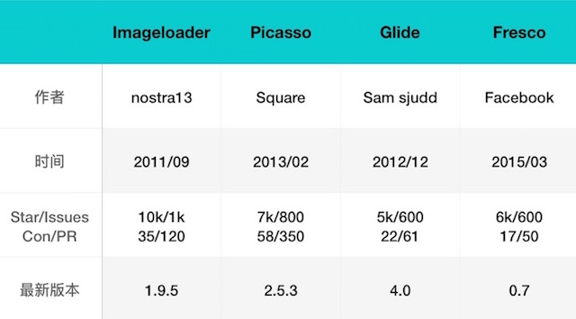
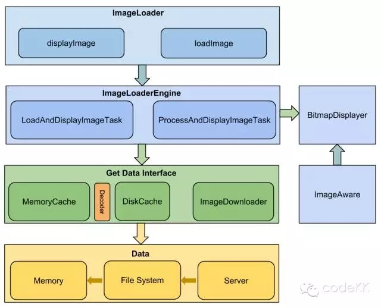
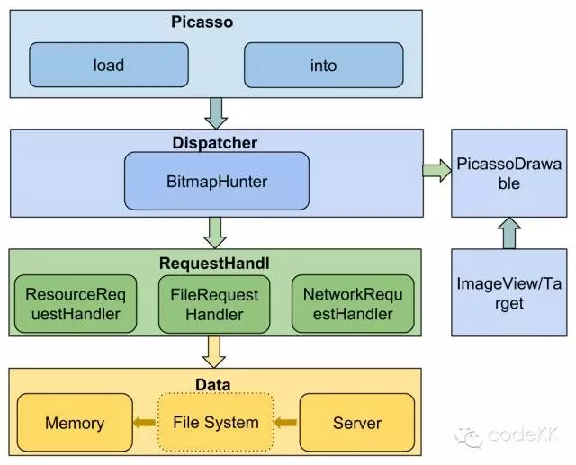
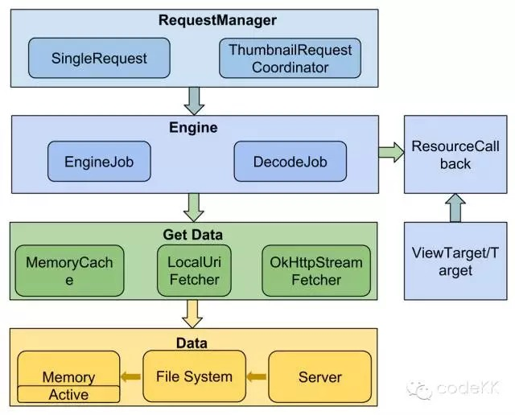
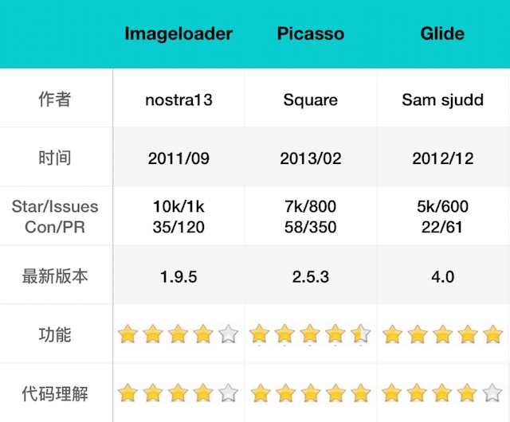

Android 三大图片缓存原理、特性对比
----------------
> 本文来源[trinea](http://www.trinea.cn/)博客中的 [Android 三大图片缓存原理、特性对比](http://www.trinea.cn/android/android-image-cache-compare/) 

这是我在 MDCC 上分享的内容(略微改动)，也是源码解析第一期发布时介绍的源码解析后续会慢慢做的事。
 
从总体设计和原理上对几个图片缓存进行对比，没用到他们的朋友也可以了解他们在某些特性上的实现。
 
上篇关于选择开源项目的好处及如何选择开源项目可见：[开源项目使用及选型](http://www.trinea.cn/other/open-source-choice/)。

### 一. 四大图片缓存基本信息

**[Universal ImageLoader](Android-Universal-Image-Loader)** 是很早开源的图片缓存，在早期被很多应用使用。
 
**[Picasso](https://github.com/square/picasso)** 是 Square 开源的项目，且他的主导者是 JakeWharton，所以广为人知。
 
**[Glide](https://github.com/bumptech/glide)** 是 Google 员工的开源项目，被一些 Google App 使用，在去年的 Google I/O 上被推荐，不过目前国内资料不多。
 
**[Fresco](https://github.com/facebook/fresco)** 是 Facebook 在今年上半年开源的图片缓存，主要特点包括：

1. 两个内存缓存加上 Native 缓存构成了三级缓存
2. 支持流式，可以类似网页上模糊渐进式显示图片
3. 对多帧动画图片支持更好，如 Gif、WebP
 
鉴于 Fresco 还没发布正式的 1.0 版本，同时一直没太多时间熟悉 Fresco 源码，后面对比不包括 Fresco，以后有时间再加入对比。

###二、基本概念
在正式对比前，先了解几个图片缓存通用的概念：

(1) RequestManager：请求生成和管理模块  
(2) Engine：引擎部分，负责创建任务(获取数据)，并调度执行 
(3) GetDataInterface：数据获取接口，负责从各个数据源获取数据。比如 MemoryCache 从内存缓存获取数据、DiskCache 从本地缓存获取数据，下载器从网络获取数据等。 
(4) Displayer：资源(图片)显示器，用于显示或操作资源。比如 ImageView，这几个图片缓存都不仅仅支持 ImageView，同时支持其他 View 以及虚拟的 Displayer 概念。 
(5) Processor 资源(图片)处理器 
负责处理资源，比如旋转、压缩、截取等。
 
以上概念的称呼在不同图片缓存中可能不同，比如 Displayer 在 ImageLoader 中叫做 ImageAware，在 Picasso 和 Glide 中叫做 Target。

###三、共同优点
####1. 使用简单
都可以通过一句代码可实现图片获取和显示。
####2. 可配置度高，自适应程度高
图片缓存的下载器(重试机制)、解码器、显示器、处理器、内存缓存、本地缓存、线程池、缓存算法等大都可轻松配置。
 
自适应程度高，根据系统性能初始化缓存配置、系统信息变更后动态调整策略。 
比如根据 CPU 核数确定最大并发数，根据可用内存确定内存缓存大小，网络状态变化时调整最大并发数等。
#### 3. 多级缓存 ####
都至少有两级缓存、提高图片加载速度。
#### 4. 支持多种数据源 ####
支持多种数据源：网络、本地、资源、Assets 等
#### 5. 支持多种 Displayer ####
不仅仅支持 ImageView，同时支持其他 View 以及虚拟的 Displayer 概念。
 
其他小的共同点包括支持动画、支持 transform 处理、获取 EXIF 信息等。

### 四、ImageLoader 设计及优点 ###

#### 1. 总体设计及流程 ####
上面是 ImageLoader 的总体设计图。整个库分为 ImageLoaderEngine，Cache 及 ImageDownloader，ImageDecoder，BitmapDisplayer，BitmapProcessor 五大模块，其中 Cache 分为 MemoryCache 和 DiskCache 两部分。
 
简单的讲就是 ImageLoader 收到加载及显示图片的任务，并将它交给 ImageLoaderEngine，ImageLoaderEngine 分发任务到具体线程池去执行，任务通过 Cache 及 ImageDownloader 获取图片，中间可能经过 BitmapProcessor 和 ImageDecoder 处理，最终转换为Bitmap 交给 BitmapDisplayer 在 ImageAware 中显示。
 
#### 2. ImageLoader 优点 ####
1. **支持下载进度监听**
2. **可以在 View 滚动中暂停图片加载**  通过 PauseOnScrollListener 接口可以在 View 滚动中暂停图片加载。
3. **默认实现多种内存缓存算法**  这几个图片缓存都可以配置缓存算法，不过 ImageLoader 默认实现了较多缓存算法，如 Size 最大先删除、使用最少先删除、最近最少使用、先进先删除、时间最长先删除等。
4. 支持本地缓存文件名规则定义

### 五、Picasso 设计及优点 ###

#### 1. 总体设计及流程 ####
上面是 Picasso 的总体设计图。整个库分为 Dispatcher，RequestHandler 及 Downloader，PicassoDrawable 等模块。
 
Dispatcher 负责分发和处理 Action，包括提交、暂停、继续、取消、网络状态变化、重试等等。
 
简单的讲就是 Picasso 收到加载及显示图片的任务，创建 Request 并将它交给 Dispatcher，Dispatcher 分发任务到具体 RequestHandler，任务通过 MemoryCache 及 Handler(数据获取接口) 获取图片，图片获取成功后通过 PicassoDrawable 显示到 Target 中。
 
需要注意的是上面 Data 的 File system 部分，Picasso 没有自定义本地缓存的接口，默认使用 http 的本地缓存，API 9 以上使用 okhttp，以下使用 Urlconnection，所以如果需要自定义本地缓存就需要重定义 Downloader。
 
#### 2. Picasso 优点 ####
1. **自带统计监控功能**  
支持图片缓存使用的监控，包括缓存命中率、已使用内存大小、节省的流量等。
2. **支持优先级处理**  
每次任务调度前会选择优先级高的任务，比如 App 页面中 Banner 的优先级高于 Icon 时就很适用。
3. **支持延迟到图片尺寸计算完成加载**
4. **支持飞行模式、并发线程数根据网络类型而变**  
手机切换到飞行模式或网络类型变换时会自动调整线程池最大并发数，比如 wifi 最大并发为 4， 4g 为 3，3g 为 2。 
这里 Picasso 根据网络类型来决定最大并发数，而不是 CPU 核数。
5.  **“无”本地缓存**  
无”本地缓存，不是说没有本地缓存，而是 Picasso 自己没有实现，交给了 Square 的另外一个网络库 okhttp 去实现，这样的好处是可以通过请求 Response Header 中的 Cache-Control 及 Expired 控制图片的过期时间。

### 六、Glide 设计及优点 ###

#### 1. 总体设计及流程 ####
上面是 Glide 的总体设计图。整个库分为 RequestManager(请求管理器)，Engine(数据获取引擎)、 Fetcher(数据获取器)、MemoryCache(内存缓存)、DiskLRUCache、Transformation(图片处理)、Encoder(本地缓存存储)、Registry(图片类型及解析器配置)、Target(目标) 等模块。
 
简单的讲就是 Glide 收到加载及显示资源的任务，创建 Request 并将它交给RequestManager，Request 启动 Engine 去数据源获取资源(通过 Fetcher )，获取到后 Transformation 处理后交给 Target。
 
Glide 依赖于 DiskLRUCache、GifDecoder 等开源库去完成本地缓存和 Gif 图片解码工作。
 
#### 2. Glide 优点 ####
1. **图片缓存->媒体缓存**  
Glide 不仅是一个图片缓存，它支持 Gif、WebP、缩略图。甚至是 Video，所以更该当做一个媒体缓存。
2. **支持优先级处理**
3. **与 Activity/Fragment 生命周期一致，支持 trimMemory**  
Glide 对每个 context 都保持一个 RequestManager，通过 FragmentTransaction 保持与 Activity/Fragment 生命周期一致，并且有对应的 trimMemory 接口实现可供调用。
4. **支持 okhttp、Volley**  
Glide 默认通过 UrlConnection 获取数据，可以配合 okhttp 或是 Volley 使用。实际 ImageLoader、Picasso 也都支持 okhttp、Volley。
5. **内存友好**

	① Glide 的内存缓存有个 active 的设计  
从内存缓存中取数据时，不像一般的实现用 get，而是用 remove，再将这个缓存数据放到一个 value 为软引用的 activeResources map 中，并计数引用数，在图片加载完成后进行判断，如果引用计数为空则回收掉。
 
	② 内存缓存更小图片 
Glide 以 url、view_width、view_height、屏幕的分辨率等做为联合 key，将处理后的图片缓存在内存缓存中，而不是原始图片以节省大小
 
	③ 与 Activity/Fragment 生命周期一致，支持 trimMemory
 
	④ 图片默认使用默认 RGB_565 而不是 ARGB_888 
虽然清晰度差些，但图片更小，也可配置到 ARGB_888。
 
其他：Glide 可以通过 signature 或不使用本地缓存支持 url 过期

### 七、汇总 ###

三者总体上来说，ImageLoader 的功能以及代理容易理解长度都一般。
 
Picasso 代码虽然只在一个包下，没有严格的包区分，但代码简单、逻辑清晰，一两个小时就能叫深入的了解完。
 
Glide 功能强大，但代码量大、流转复杂。在较深掌握的情况下才推荐使用，免得出了问题难以下手解决。

