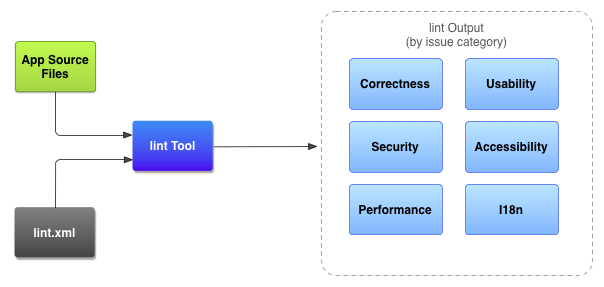

Android APK安装包瘦身
====
APK在安装和更新之前都需要经过网络将其下载到手机，如果APK越大消耗的流量就会越多，特别是对于使用移动网络的用户来讲，消耗流量越多就代表需要花更多的钱去购买流量。同时一些第三方应用商城也会对上传的APK大小有限制，所以为了能够让产品能够更受商城和用户欢迎，APK瘦身是第一步，更小的APK标示着更多地用户愿意去下载和体验。

下面从代码，资源文件，使用策略几个方面简要介绍下：

## 代码 ##
- 保持良好的编程习惯，不要重复或者不用的代码，移除或者减少使用不到的libs。（例如减少support-v4中一些目前不需要用到的类；）
- 使用proguard混淆代码，它会对不用的代码做优化，并且混淆后也能够减少安装包的大小。
- native code的部分，大多数情况下只需要支持armabi与x86的架构即可。如果非必须，可以考虑拿掉x86的部分。

## 资源 ##
- 使用Lint工具查找没有使用到的资源。去除不使用的图片，String，XML等等。
- assets目录下的资源请确保没有用不上的文件。
- 生成APK的时候，aapt工具本身会对png做优化，但是还可以使用工具[tinypng](https://tinypng.com/)和[webP](https://developers.google.com/speed/webp/?csw=1)对图片进行进一步的压缩预处理。
- jpeg还是png，根据需要做选择，在某些时候jpeg可以减少图片的体积。
- 对于9.png的图片，可拉伸区域尽量切小，另外可以通过使用9.png拉伸达到大图效果的时候尽量不要使用整张大图。
- 布局优化，使用标签 include、viewstub、merge

## 策略 ##
- 有选择性的提供hdpi，xhdpi，xxhdpi的图片资源。建议优先提供xhdpi的图片，对于mdpi，ldpi与xxxhdpi根据需要提供有差异的部分即可。
- 尽可能的重用已有的图片资源。例如对称的图片，只需要提供一张，另外一张图片可以通过代码旋转的方式实现。
- 能用代码绘制实现的功能，尽量不要使用大量的图片。例如减少使用多张图片组成animate-list的AnimationDrawable，这种方式提供了多张图片很占空间。
- 一些纯色的图片可以用颜色值代替。
- 资源动态加载：部分资源文件、数据库文件可从网络获取；
- 功能模块插件化；

## 总结 ##
一个好的应用，需要具备很多优点，尽可能提供小的安装包是其中一个重要的方面。以上的小技巧，需要综合考虑，结合实际情况进行取舍。当然我们还可以采取一些按需加载的策略来减少安装包的体积，最好提一点，砍掉不必要的功能才是安装包瘦身的终极奥秘。O(∩_∩)O哈！

### 资源动态加载 ###
安装包只放置最基本的资源，部分资源可以通过网络的后期动态下载。

  例子：微信的emoji表情

  优化前：打包表情576项，大小2.3M

  优化后：打包表情120项，是原来的1/5

  **场景：**动态下载的资源在资源缺失的情况下不会造成不可用

  **局限：**消耗后期流量和无网络情况下体验下降

### 布局优化 ###
布局标签

1. <include> 标签：将布局中公共部分提取出来共用；例如网易新闻一条新闻的标题栏和评论界面的标题栏。
2. <viewstub> 标签：同 include，可引入布局，但是默认情况引入的布局不会占用资源，在解析当前 Layout 时节省计算、内存资源。当需要加载此 View 的时候，需要动态 inflate 起来。
Tips：将一个view设置为GONE不会被系统解析，从而提高layout解析速度，而VISIBLE和INVISIBLE这两个可见性属性会被正常解析。
3. <merge> 标签，解决 Layout 嵌套过多的问题，通过工具通过 hierarchy viewer 可直观的显示出来。
4. 减少 inflate 次数：inflate 是比较耗资源的，当内存够用时，可以将 View 缓存起来，下次直接使用；用空间换时间。

### Lint工具 ###
Android lint是在ADT 16提供的新工具，它是一个代码扫描工具，能够帮助我们识别代码结构存在的问题，主要包括：

1. 布局性能（以前是 layoutopt工具，可以解决无用布局、嵌套太多、布局太多）
2. 未使用到资源
3. 不一致的数组大小
4. 国际化问题（硬编码）
5. 图标的问题（重复的图标，错误的大小）
6. 可用性问题（如不指定的文本字段的输入型）
7. manifest文件的错误

Android lint可以解决如上的问题，当然还有更多，具体的可以参考Android Lint Checks。Android官方也总结了lint能解决的问题，如下图。

这是关于Lint工具的详细使用文章：
[http://blog.csdn.net/xyz_lmn/article/details/14222939](http://blog.csdn.net/xyz_lmn/article/details/14222939)

### 使用tinypng优化大部分图片资源： ###
[tinypng](https://tinypng.com/)是一个支持压缩png和jpg图片格式的网站，通过其独特的算法（通过一种叫“量化”的技术，把原本png文件的24位真彩色压缩为8位的索引演示，是一种矢量压缩方法，把颜色值用数值123等代替。）可以实现在无损压缩的情况下图片文件大小缩小到原来的30%-50%。压缩率和压缩后的效果如下：

上面的图片对比举例不太好，不过可以看到压缩前后图片效果并没有变化，需要说明的是：tinypng支持png和jpg图片的压缩，并且也支持9图的压缩。

  tinypng的缺点是在压缩某些带有过渡效果（带alpha值）的图片时，图片会失真，这种图片可以将png图片转换为下面介绍的webP格式，可以在保证图片质量的前提下大幅缩小图片的大小。

  tinypng提供了开放接口供开发者开发属于自己的压缩工具，不过这是付费服务，对于普通用户来说，tinypng为每个用户提供的每月图片免费压缩数量已经足够了。

### 从APK的文件结构说起 ###
为了能够减小APK的大小，首先需要知道APK由哪些部分构成，然后针对每个部分做相应的优化工作，下图是一个APK解压后的文件结构:

### 使用webP图片格式 ###
[WebP](https://developers.google.com/speed/webp/)是谷歌研发出来的一种图片数据格式，它是一种支持有损压缩和无损压缩的图片文件格式，派生自图像编码格式 VP8。根据 Google 的测试，无损压缩后的 WebP 比 PNG 文件少了 45％ 的文件大小，即使这些 PNG 文件经过其他压缩工具压缩之后，WebP 还是可以减少 28％ 的文件大小。目前很多公司已经将webP技术运用到Android APP中，比如FaceBook、腾讯、淘宝。webP相比于png最明显的问题是加载稍慢，不过现在的智能设备硬件配置越来越高，这都不是事儿。

假如你打算在 App 中使用 WebP，除了 Android4.0 以上提供的原生支持外，其他版本以可以使用官方提供的解析库webp-android-backport编译成so使用。

通常UI提供的图片都是png或者jpg格式，我们可以通过智图或者isparta将其它格式的图片转换成webP格式，isparta可实现批量转换，墙裂推荐！

各文件的介绍如下： [参考文章](http://blog.csdn.net/bupt073114/article/details/42298337)

- **classes.dex：**classes.dex是java源码编译后生成的java字节码文件。但由于Android使用的dalvik虚拟机与标准的java虚拟机是不兼容的，dex文件与class文件相比，不论是文件结构还是opcode都不一样。目前常见的java反编译工具都不能处理dex文件。Android模拟器中提供了一个dex文件的反编译工具，dexdump。用法为首先启动Android模拟器，把要查看的dex文件用adb push上传的模拟器中，然后通过adb shell登录，找到要查看的dex文件，执行dexdump xxx.dex。另，有人介绍到Dedexer是目前在网上能找到的唯一一个反编译dex文件的开源工具，需要自己编译源代码。
- **resources.arsc：**编译后的二进制资源文件
- **AndroidManifest.xml：**该文件是每个应用都必须定义和包含的，它描述了应用的名字、版本、权限、引用的库文件等等信息，如要把apk上传到Google Market上，也要对这个xml做一些配置。在apk中的AndroidManifest.xml是经过压缩的，可以通过AXMLPrinter2工具解开，具体命令为：java -jar AXMLPrinter2.jar AndroidManifest.xml
- **proguard.cfg：**代码混淆配置文件；
- **project.properties：**标示APK的target sdk和依赖关系，这里的依赖关系指示的是该APK依赖到了哪些工程；
- **assets：**assets目录可以存放一些配置文件（比如webview本地资源、图片资源等等），这些文件的内容在程序运行过程中可以通过相关的API获得。具体的方法可以参考SDK中的例子：在sdk的 \SDK\1.6\android-sdk-windows-1.6_r1\platforms\android-1.6\samples\ApiDemos 例子中，有个com.example..android.apis.content 的例子，在这个例子中他把一个text文件放到工程的asset目录下，然后把这个txt当作普通文件处理。处理的过程在ReadAsset.java中。同理，asset也可以放置其他文件。
- **lib：**lib目录下的子目录armeabi存放的是一些so文件。这个地方多讲几句，都是在开发过程中摸索出来的。eclipse在打包的时候会根据文件名的命名规则（lib**.so）去打包so文件，开头和结尾必须分别为“lib”和“.so”，否则是不会打包到apk文件中的。其他非eclipse开发环境没有测试过。如果你是用SDK和NDK开发的话，这部分很重要，甚至可以通过把一些不是so文件的文件通过改名打包到apk中，具体能干些什么那就看你想干什么了.
- **META-INF：**META-INF目录下存放的是签名信息，用来保证apk包的完整性和系统的安全。在eclipse编译生成一个apk包时，会对所有要打包的文件做一个校验计算，并把计算结果放在META-INF目录下。这就保证了apk包里的文件不能被随意替换。比如拿到一个apk包后，如果想要替换里面的一幅图片，一段代码， 或一段版权信息，想直接解压缩、替换再重新打包，基本是不可能的。如此一来就给病毒感染和恶意修改增加了难度，有助于保护系统的安全。
- **res：**res目录存放资源文件。包括图片、字符串、raw文件夹下面的音频文件、各种xml文件等等。

从上图可知，APK中classes.dex、lib、资源文件是大头，APK瘦身主要就是优化这三类，关于这三种类型的文件比较成熟的优化方法有：

1. **classes.dex:**通过代码混淆，删掉不必要的jar包和代码实现该文件的优化；
2. **lib:**一个硬件设备对应一个架构（mips、arm或者x86），只保留与设备架构相关的库文件夹（主流的架构都是arm的，mips属于小众，默认也是支持arm的so的，但x86的不支持），这样可以大大降低lib文件夹的大小；
3. **资源文件：**通过Lint工具扫描代码中没有使用到的静态资源。

  上面介绍的三种类型文件的优化方案的确能够在一定程度上减小APK的大小，但在最近做项目的过程中经过研究发现还可以更进一步优化APK的大小，具体方案如下：

**多分辨率适配：**我之前写过一篇关于多分辨率适配的文章Android多分辨率适配经验总结,一套图、一套布局，多套dimens.xml文件，在使用最小资源的情况下搞定多分辨率适配；

**预置数据：**和游戏一样，程序和数据分离，进入模块时下载预置数据（下载的策略需要注重用户体验，在需要使用数据的地方下载）；

**图片资源：**使用tinypng和webP，下面详细介绍图片资源优化的方案。

