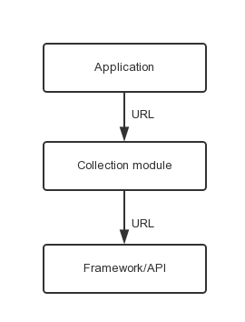

App崩溃分析：如何监控http请求并做出优化？
----------------

## 前言 ##
移动互联网时代，移动App与服务器之间的交互越来越频繁，数据量也越来越大，伴随而来的各种网络连接问题也在影响着各App的留存率。如何保证http请求的质量成为开发者们需要解决的一大问题。本文着重讲述http请求遇到的问题以及该如何监控和优化。

### http请求遇到的问题 ###
在App开发过程中，通常是用无线网络去做测试，这样网络的连通率、速度以及响应时间都是处在一个相对理想的情况下，但是在App发布后，用户使用场景往往是**2G、3G**，以及一些网络水平初级的地区，网速和连通率都在一个不稳定甚至极低的水平，这时，一系列的问题随之而来，其中我们主要讨论两点：

- **响应时间：**由于网络速度的下降， 响应时间开始变长，同一个url的访问时间可能会成倍增长，增加用户的等待时间；
- **错误率：**由于网络质量的下降，丢包错包概率成倍增长，由于请求的错误也会导致服务器端处理错误率的提高，可能会造成返回数据为空或者错误，致使用户增加使用成本。

### 如何去优化？ ###
应用向服务器发送http请求，一般都是调用的系统接口或者第三方接口（比如OKHttp）：

这个时候，我们可以在应用调用接口时，加一个收集模块来采集http信息，如图：

Collection module可以用不同的实现方式：iOS利用Runtime通过代码注入的方式去获取相关信息；Android通过自定义URLStreamHandler去获取http信息，之后通过一些统计工具可以直观地去分析和优化应用的网络模块。

### 如何利用网络监控去做优化？ ###
那么，究竟该如何利用好网络监控来进行应用优化？开发者可以从 **http响应时间、http错误率、请求量（rpm）和Data I/O** 四个维度监控http请求，并监测每个url的运营商、终端设备、错误码。同时，地理定位功能可以提供每个地区网络状况的平均值，方便开发者去分析和优化。

- **http响应时间**  
通过响应时间的长短，可以判断哪个url去优化，如果响应时间长，是不是后台查询过慢？还是因为运营商基站建的少网络信号差？
- **http错误率**  
通过错误率，可以知道访问某个url时最多的错误码是多少，根据错误码去确定是请求错误还是服务器错误，从而缩小问题的查找范围。
- **请求量（rpm）**  
通过查看url的请求量，可以去推断用户的喜好，从而做一些定制化的服务，也可以通过这个指标去确定App端发请求频率是否正常。
- **Data I/O**  
通过Data I/O，可以知道某个url的请求数据大小是否正常，是否流量过大可以进行压缩从而节省用户的费用。

当然，每个指标不是独立的，而是应该综合来判断。**举一个例子**，做一个在线图库的应用，用户反映一直刷不出图，那就可以这样推断一下：**看http响应时间** ，如果正常，有可能是App收到数据后显示有问题，如果过长，那么可能是服务器端问题；**再看错误率**，如果很高，那么有可能是服务器返回结果有问题，如果不高，那么有可能是因为网络信号差导致的。

这个时候，再看一下**请求量**和**Data I/O**，如果请求量很小，但是Data I/O很高，那么是否可以优化http请求策略？如果改成每次请求一屏的数据，根据用户的翻页情况发送多次请求，而不是一次去请求几页数据，那么这样数据总量没变，但是用户看到的效果却是每翻一页，只要很少的时间就可以显示出图片，这样就可以提升用户体验。

简单论述了网络问题对于移动App产生的影响，以及如何去监控http请求并做出优化。当然，实现监控的方式有很多，也可以有很多技术上的玩法，但无论技术实现得有多好，如何优化App？提升用户体验和留存率，才是开发者最该关心的问题。

