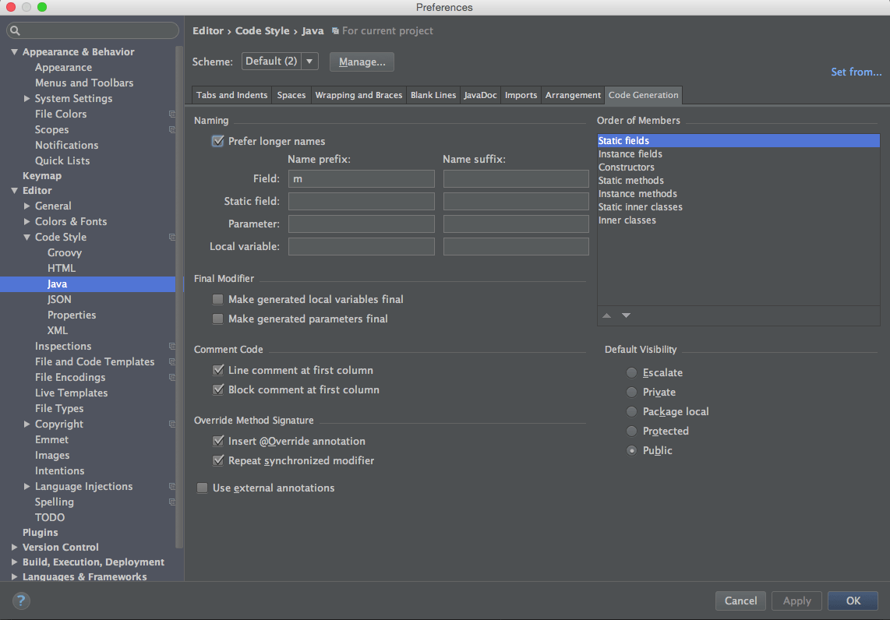
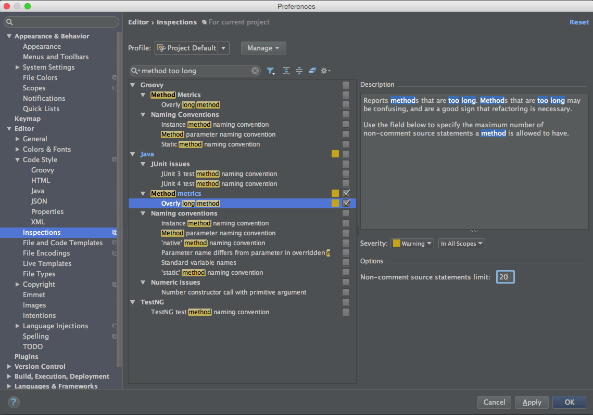
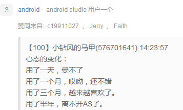

开发一个Android App你需要知道的一些事
---
> * 原文链接 : [Android-Excellent-Articles](https://github.com/maguohui/Android-Excellent-Articles)
> * 编   辑 : [maguohui](https://github.com/maguohui)

这列罗列的事情在你开发第一个Android应用的时候需要牢记在大脑中。这些我接下来将展示的实际错误来自于我的第一个应用程序代码中。把这些错误经验牢记心头能够帮助你开发一个你可以引以为豪的应用。

当然，正如codestandards所说：“如果你所做的工作和你作为学生开发的Android应用类似，你很有可能会讨厌你的应用”。

 *如果一年前你写的代码对于你来说感觉还不错，你很大程度上没有进行足够的学习。*

*-Code Standards  2015.5.21*

## 开发之前你需要知道的 ##
如果你是一位经验丰富的Java开发者，第1、2、5条很有可能对你没有吸引力。另一方面，即使你从来没有犯过这些例子中的错误，第3、4条也可能向你展示一些很酷的事物，你可以利用一款也许你不知道的软件Android Studio去实现这些事物。

###1.不要持有Context的静态引用

	public class MainActivity extends LocationManagingActivity implements ActionBar.OnNavigationListener,
        GooglePlayServicesClient.ConnectionCallbacks,
        GooglePlayServicesClient.OnConnectionFailedListener {
    	//...
    	private static MeTrackerStore mMeTrackerStore; 
  	  	//...
   	 	@Override
   		protected void onCreate(Bundle savedInstanceState) {
        	//...
       		mMeTrackerStore = new MeTrackerStore(this);
    	}
	}

这对于每个人来说看似是一个不可能犯的错误。它不是，我犯了这个错误。我也看到过别人犯这个错误，同时我也采访过那些不能很快指出为什么这是放在第一位的错误的人。不要这样做，它是会变的。

如果MeTrackerStore 通过它的构造函数保持一个指向Activity的引用，这个Activity将不会被垃圾回收(GC)。（除非静态变量被从新分配到不同的Activity）。这是因为mMeTrackerStore 是静态变量，而静态变量的内存是不会被回收，直到应用程序退出才回收。如果你正在试图做这样的事情，你的代码很有可能有严重的错误。寻找帮助吧，可能看看谷歌的Udacity 课程“[Android Development for Beginners](https://www.udacity.com/course/android-development-for-beginners--ud837)”能够帮助你。

**注：**从技术上说，你可以对一个Application Context进行静态变量引用而不引起内存泄露，[但我不建议你这样做](http://www.philosophicalhacker.com/2015/07/14/why-static-references-to-application-contexts-are-probably-not-the-best-idea/)。

###2.注意那些你无法控制生命周期的对象的隐式引用

	public class DefineGeofenceFragment extends Fragment {
    	public class GetLatAndLongAndUpdateMapCameraAsyncTask extends 	AsyncTask<String, Void, LatLng> {

       	 	@Override
        	protected LatLng doInBackground(String... params) {
           		 //...
            	 try {
	                //Here we make the http request for the place search suggestions
	                httpResponse = httpClient.execute(httpPost);
	                HttpEntity entity = httpResponse.getEntity();
	                inputStream = entity.getContent();
	                //..
            	}
        	}
    	}
	}

这段代码有很多问题，我将只会把重点问题放在“隐式引用”那些问题上。在Java中，（非静态）内部类有个对外部类实例有个隐式引用。

在这个例子中，任何GetLatAndLongAndUpdateCameraAsyncTask都有一个外部类DefineGeofenceFragment的引用。对于匿名类是同样的，它们也有一个对包含它们的类的实例的一个隐式引用。

GetLatAndLongAndUpdateCameraAsyncTask对生命周期我们无法控制的Fragment对象有一个隐式引用。Android SDK负责创建和销毁Fragment，如果GetLatAndLongAndUpdateCameraAsyncTask 因为正在运行而不能被垃圾回收，那么DefineGeofenceFragment 也将因为具有隐式引用而保留不能被垃圾回收。

这里有一个很棒的谷歌视频，[解释它为什么会发生这种事情](https://www.youtube.com/watch?v=_CruQY55HOk)。

###3.使用Android Studio进行工作

这段代码是我使用“Generate Getter”在Android Studio中进行生成的。这些getter保持了'm'前缀的实例变量，同样通过它也能为一个方法产生相同的效果，这已经不是空想。

（如果你想知道为什么'm'是实例变量的名称的第一个字母,'m'往往是实例变量的公认约定。它代表了'member'(成员)的意思）。

不管你是否认为实例变量的前缀'm'是一个好注意，在这有一个知识，Android Studio能够帮助你编写任何你想要实现的公认约定。例如，在你为实例变量生成getters、setters和connstructor参数时，你可以使用Android Studio代码风格对话框的设置使Android Studio在你的实例变量前自动添加'm'和移除'm'。

Android Studio能够做的远不止于此。学习Android Studio从学习快捷键和模版是不错的开始。

###4.一个函数只做一件事

在我写的众多类中的一个类存在一个方法我写了有100多行。这类的方法是非常难以读懂、修改和重用。努力让一个方法只做一件事情。显然，这意味着你应该对超过20行的方法持有怀疑态度。这里，你可以使用Android Studio来帮助你发现有问题的方法：

###5.向聪明和有经验的人学习

这可能听起来微不足道，但是这是我开发我的第一个应用时候犯下的错误。

当你开发一个应用的时候，你会犯别人已经犯过的错误。向别人学习，你可以避免犯别人犯过的错误来节约你的时间。我在我的第一个应用中浪费了大量的时间犯错，这些错误如果我花点时间向有经验的软件开发工程师学习就可以避免。

阅读[Pragmatic Programmer](http://www.amazon.com/The-Pragmatic-Programmer-Journeyman-Master/dp/020161622X)，然后阅读[Effective Java](http://www.amazon.com/Effective-Java-Edition-Joshua-Bloch/dp/0321356683)。这两本书会帮助你避免开发新手常犯的错误。在你学习了这两本书后，不停地寻找聪明的人并向他们学习。

###6.使用类库

当你开发应用的时候，你可能会遇到一些聪明人和有经验人已经解决过的问题。而且，许多这些问题的解决方案是可以作为开源库的，充分利用它们。

在我的第一个应用中，我写了一些类库已经提供的功能代码。其中一些是java标准库，还有一些是第三方类库，如Retrofit和Picasso。如果你不确定你使用什么样的类库，你可以做下面3件事情：

1. 听[Google IO Fragmented](http://fragmentedpodcast.com/episodes/9/)广播。在这期间，询问这些开发者什么第三方类库类库对Android很重要。

2. 订阅[Android周刊](http://androidweekly.net/)。这里包含了一部分最新的类库，时刻注意哪些对自己有用。

3. 寻找那些能够解决与你在开发应用中遇到问题类似的开源应用。你可能发现某个应用使用的第三方类库就是你想要的，或者你会发现一个你所不知道的java类库。

## 开发过程中模块设计和可能用到的类库 ##
### 1.网络模块 ###
已经很少有单机版的App了吧，大部分都需要联网，从服务器请求数据，因此网络模模块必不可少。GitHub上的开源网络框架也特别多，个人认为可以使用开源框架，目前我会选[okHttp](https://github.com/square/okhttp),[android-async-http](https://github.com/loopj/android-async-http)或者[Volley](https://android.googlesource.com/platform/frameworks/volley)，也许以后会有更好的网络框架出现。注意如果使用开源框架，则必须要阅读其源码，必须能够驾驭它，这样就不至于当bug出现时束手无策。当然还可以自己写网络模块，目前我们的App网络模块就完全是自己写的，这样的好处是自己熟悉所写的代码，当有bug时可以迅速定位问题，同时注意处理一些联网过程中的细节，如：

1. 对HTTPS的支持、HTTPS证书的验证（目前很多做法都是默认允许所有HTTPS证书的，其实这样做是不安全的，应当真正地做证书校验）
2. 支持Wap方式上网，移动、联通、电信代理的设置
3. 支持重定向、数据压缩传输等
4. 其他值得注意的问题

自己写网络框架可以完美地处理这些细节，但时间成本比较大。如果使用开源框架，一般都没有处理这些细节，因此我们可以在第三方框架上做些修改，这样时间成本将会节省很多。

### 2.图片管理模块 ###
图片也是App中不可少的元素，而且图片是占用内存的大户，因此图片管理框架特别重要，不好的图片框架容易引起内存泄露甚至导致崩溃。当然可以自己实现图片框架（目前我们也是这样做的），实现图片的下载、解码、缓存等关键环节。个人建议可以采用一些比较好的图片库，也许会比我们自己管理图片更完善和高效。我会推荐如下几个图片管理库：

1. [Glide](https://github.com/bumptech/glide)，Google的一些官方App，如Google photos都使用了，还要解释更多吗？
2. [Fresco](https://github.com/facebook/fresco)，FaceBook的开源库，功能超级强大，支持WebP、Gif、JPEG渐进显示，关键是其对图片内存的设计思想，使得图片内存开销大大减少。
3. [Android-Universal-Image-Loader](https://github.com/nostra13/Android-Universal-Image-Loader)，在出现上述图片库之前，貌似这个最火吧，之前个人的App中也用了它。
4. [Picasso](https://github.com/square/picasso)，Square的开源库，据说Glide就是参考Picasso设计的。

### 3.本地数据库模块 ###
也许你的App需要用到本地数据库，那么建议你采用流行的ORM框架，如[ActiveAndroid](https://github.com/pardom/ActiveAndroid)或[greenDAO](https://github.com/greenrobot/greenDAO)，使用第三方库会大大方便你对sqlite的操作，个人认为在使用中我们需要注意数据库升级以及多线程并发操作数据库的问题。

### 4.文件管理模块 ###
一个App，肯定会涉及到一些文件，如配置文件、图片、视频、音频、SharedPreferences文件等。我们可以提供一个全局的文件管理模块，负责文件的增、删、改、查等操作。另外还需支持文件压缩，文件的上传与下载操作，对于下载需要支持多线程并发下载、断点续传等功能。

### 5.组件内、组件间通信机制 ###
对于一个App，组件通信必不可少，通信类型可以分为点对点和点对面的的通信，点对点即只有唯一的接收者可以响应消息，点对面则类似于消息广播，即所有注册过的都可以响应消息。在Android中，通常使用消息机制来实现，但消息机制的耦合度比较高。目前也有一些通信框架，如[EventBus](https://github.com/greenrobot/EventBus)、[Otto](https://github.com/square/otto)等事件总线框架，这些框架可以极大地降低组件间的耦合，但无法完美地实现点对点通信，因此建议消息机制和事件总线机制结合使用。

### 6.数据处理框架 ###
其实还应该有一个数据处理框架，当发出数据请求后（走子线程），经网络模块返回数据（一般为JSON格式），JSON数据一般不能直接交给View层使用，需要解析成对应的Model，同时如有需要，还要缓存数据，因此这些流程可以抽象成一个数据处理的框架。这个框架可以认为接受数据请求的url，并将数据Model返回给Activity或Fragment。对于JSON数据解析，建议使用[fastjson](https://github.com/alibaba/fastjson)，速度快且稳定，缺省值也比较完善。Google的[gson](https://github.com/google/gson)也是不错的

### 7.线程调度模块 ###
其实Android中有很多操作，如请求数据、下载图片、清除缓存等都是需要在子线程中执行的，往往很多时候都是直接起一个Thread来做了，这样做就会很乱而且线程多了将难以管理。因此可以抽象出一个线程调度模块，它维护一个线程池，如果有需要线程的话就通过线程调度模块取线程来做，这样就方便统一管理。当然第三方库中的线程操作我们将无法归到线程调度模块来管理，但其他涉及到线程的操作都应该来统一处理。

### 8.业务层 ###
业务层大概就是四大组件、Fragment、View了，建议尽可能地使用原生组件，少用自定义组件，因为原生组件性能是最好的。另外建议使用MVC模式就好，只要设计管理好自己的逻辑，至于MVP、MVVM等模式个人认为都有缺陷，总之寻求一个折中吧，有得必有失。

## 其他需要知道的事情 ##

### 1.APK动态加载机制 ###
随着App的增大，功能的扩展，很多App已经采用了APK动态加载的机制，也可以叫做插件化。由于本人没有在实际的App中应用过，所以不便发表过多评论。但这种机制个人认为很有前途，这种机制将利于App的解耦、功能扩展和局部升级。具体可以参考一个商用的解决方案：[ApkPlug-移动应用模块化解决方案](http://www.apkplug.com/)和一个开源的[APK动态加载框架](https://github.com/singwhatiwanna/dynamic-load-apk)。

### 2.App设计风格 ###
这一点对于一个开发者来说，貌似没有决定权，最终的决定权在产品部门手里。尽管这样，我还是会尽力说服产品部门将App设计成 **Material Design** 风格。这一点说多了都是泪啊，作为一个Android开发者，却整天开发着iOS风格的App，相信很多公司都这样，为了节省成本和时间，Android和iOS共用一套UI。举一个最常见的例子，Android App中每个页面TitleBar的左上角放一个返回按钮，这在iOS里是必须的，但Android有返回键啊，这样设计对于Android完全是多此一举。真心希望产品设计者尊重每种操作系统的风格及使用习惯，不要再设计不伦不类的产品。Material Design正好提供了一种这样的规范，自MD规范发布以来，其优雅的设计和清新的风格已吸引了大批设计者和开发者，如今MD设计不止在Android上（已有官方类库支持MD风格），甚至在CSS、HTML、JavaScript网页设计上都越来越火。因此，对于App的设计风格，Material Design当仁不让，也许你曾经错过了Android Design，请不要再错过Material Design。

一些相关的链接：

1. [Material Design官网](http://www.google.com/design/spec/material-design/introduction.html)
2. [Material Design配色模板](http://www.materialpalette.com/)
3. [MD一个设计案例网站](http://www.materialup.com/)
4. [MD风格的Andorid抽屉源码：Android-MaterialDesign-NavigationDrawer](https://github.com/ASPOOK/Android-MaterialDesign-NavigationDrawer)
5. [MD风格的一个App源码（有妹子哦）：Android-MaterialDesign-DBMZ](https://github.com/ASPOOK/Android-MaterialDesign-DBMZ)

### 3.版本支持 ###
对于Android要支持的最低版本，可以参考各个版本的市场占有率，其实最靠谱的是根据自家App的统计数据来决定，目前我们的App最低支持2.2。以个人观点认为，虽然2.x的版本仍然有一部分用户，但其实手机更新换代特别快，为了更好的用户体验，也为了应用更新的API（很多第三方库也都有版本要求），应该提高最低支持的版本，大概3.0为宜，即API Level为11。

### 4.开发工具的选择 ###
必须是**Android Studio**，它是Google官方指定的Android开发工具，目前是1.2.2稳定版，1.3的预览版也已经发布了。Android Studio的优点就不需多说了，再不用你就OUT了，GitHub上大部分的Android开源库也都已迁移到Android Studio上来，在未提供jar文件时，使用Android Studio可以极为方便地集成开源库。最为重要的是Google已宣布将在年底前停止对Eclipse Android开发工具的一切支持（[Google Ends Support for Android Eclipse Tools](http://www.infoq.com/news/2015/06/google-android-eclipse)），因此请早日转移到Android Studio上来。

