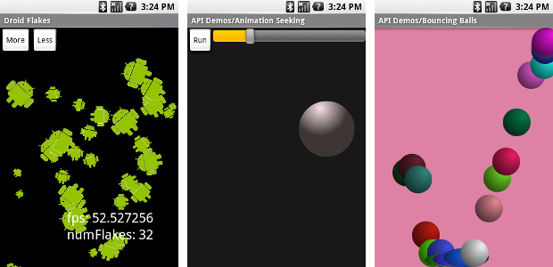
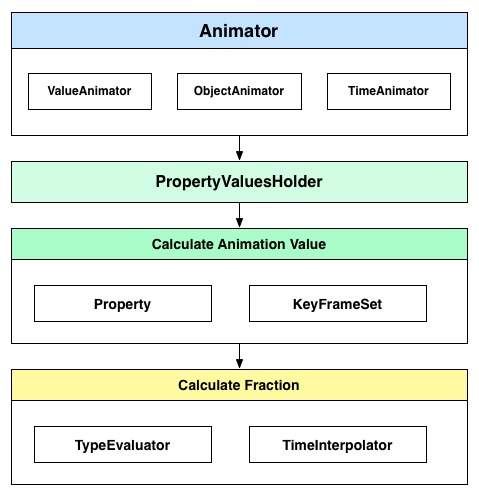
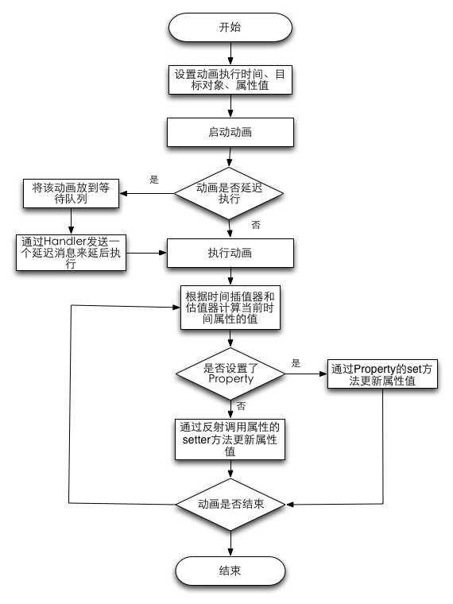
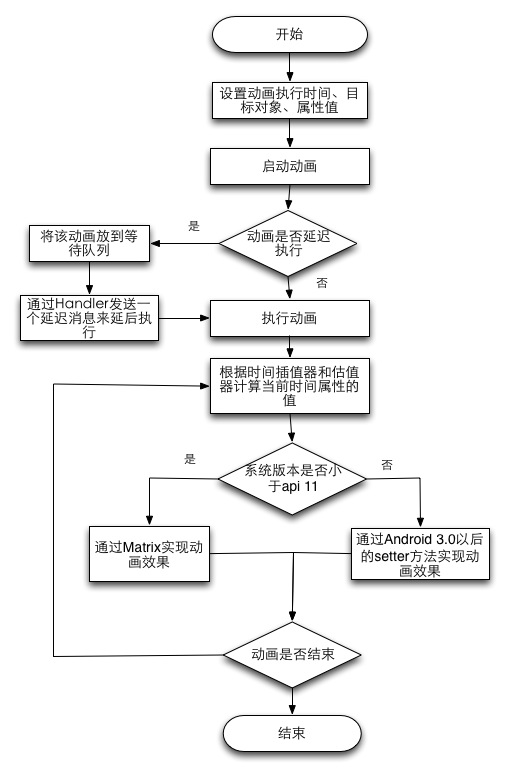
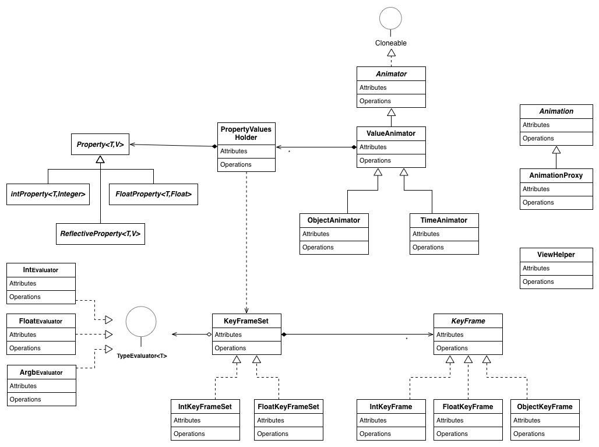

NineOldAnimations 源码解析
====================================
> 本文为 [Android 开源项目源码解析](https://github.com/android-cn/android-open-project-analysis) 中 **NineOldAnimations** 部分  
> 项目地址：[NineOldAnimations](https://github.com/JakeWharton/NineOldAndroids)，分析的版本：[d582f0e](https://github.com/JakeWharton/NineOldAndroids/commit/d582f0ec8e79013e9fa96c07986160b52e662e63)，Demo 地址：[NineoldAnimations Demo](https://github.com/aosp-exchange-group/android-open-project-demo/tree/master/nineoldanimations-demo)    
> 分析者：[Mr.Simple](https://github.com/bboyfeiyu)，校对者：[lightSky](https://github.com/lightSky)，校对状态：已完成   
 

###1. 功能介绍  
NineOldAndroids 是一款支持在低版本(API 11 以下)使用 Android 属性动画以及 3D 旋转动画的框架，它提供了一系列如 ViewAnimator,ObjectAnimator,ViewPropertyAnimator 等 API 来完成这些动画,解决了 Android 动画框架在低版本的兼容性问题。在 API 11 (Honeycomb (Android 3.0))后 Android 推出了属性动画、X 轴翻转等动画效果，但是这些效果却不能运行在 API 11 以下,NineOldAndroids 的出现使得这些动画效果能够兼容低版本系统，保证动画在各个系统版本能够完美运行。



#### 1.1 系统属性动画与 NOA 简单比较 ####
NineOldAndroids 提供了和系统属性一样的动画功能。</br>
看源码你可以发现，其实 NOA 的架构实现和系统属性动画实现架构其实是一样的。只是兼容的那一部分采用了 Matrix 实现了各种动画效果，中间多了一些辅助类，比如 `PreHoneycombCompat`，`AnimatorProxy`，`ViewHelper`，另外某些类对于兼容有些改动，其它的类几乎和系统属性动画部分是一样的。

#### 1.2 实现原理 ####
在[属性动画基础](http://www.codekk.com/open-source-project-analysis/detail/Android/lightSky/%E5%85%AC%E5%85%B1%E6%8A%80%E6%9C%AF%E7%82%B9%E4%B9%8B%20Android%20%E5%8A%A8%E7%94%BB%E5%9F%BA%E7%A1%80)中已经提到：`ValueAnimator` 的**缺点**是需要通过实现 `AnimatorUpdateListener` 自己手动去更新属性值，它的子类 `ObjectAnimator` 为用户实现了自动更新动画，但是对于自定义的属性，需要提供标准 JavaBean 的 setter 和 getter 方法，以便获取和更新属性值。NOA 也是遵循了这样的实现思路，对于 **3.0** 之前的系统来说，属性动画中所提供的属性都是新的，在实现的时候也就都属于自定义的。**NOA** 在 `PreHoneycombCompat` 中定义了这些属性，并在 get 和 setValue 中提供了标准的 setter 和 getter 方法用于设置和获取属性值，这里的 setter 和 getter 其实是直接调用 `AnimatorProxy` 类的方法。

### 2. 总体设计 ###


以上是 NineoldAnimations 的整体设计图,其实就是系统属性动画的整体设计。</br>
Animator 通过 `PropertyValuesHolder` 来更新对象的目标属性。如果用户没有设置目标属性的 `Property` 对象,那么会通过反射的形式调用目标属性的 setter 方法来更新属性值;否则则通过 `Property` 的 set 方法来设置属性值。这个属性值则通过 `KeyFrameSet` 的计算得到,而 `KeyFrameSet` 又是通过时间插值器 `TimeInterpolator` 和类型估值器 `TypeEvaluator` 来计算。在动画执行过程中不断地计算当前时刻目标属性的值,然后更新属性值来达到动画效果。

#### 2.1 类详细介绍 ####
在进行下一步的分析之前，我们先来了解一下 NineOldAndroids 中一些核心的类以及它们的作用。

- **ValueAnimator:**  该类是 Animator 的子类,实现了动画的整个处理逻辑,也是 NineOldAndroids 最为核心的类；
- **ObjectAnimator:**  对象属性动画的操作类，继承自 ValueAnimator,通过该类使用动画的形式操作对象的属性；
- **TimeInterpolator:**  时间插值器,它的作用是根据时间流逝的百分比来计算出当前属性值改变的百分比，系统预置的有 LinearInterpolator（线性插值器：匀速动画）、AccelerateDecelerateInterpolator（加速减速插值器：动画两头慢中间快）和 DecelerateInterpolator（减速插值器：动画越来越慢）等；
- **TypeEvaluator:**  TypeEvaluator 的中文翻译为类型估值算法，它的作用是根据当前属性改变的百分比来计算改变后的属性值，系统预置的有 IntEvaluator（针对整型属性）、FloatEvaluator（针对浮点型属性）和 ArgbEvaluator（针对 Color 属性）；
- **Property:**  属性对象,主要是定义了属性的 set 和 get 方法；
- PropertyValuesHolder ： PropertyValuesHolder 是持有目标属性 Property、setter 和 getter 方法、以及 KeyFrameSet 的类；
- **KeyFrame:**  一个 keyframe 对象由一对 time / value 的键值对组成，可以为动画定义某一特定时间的特定状态，Animator 传入的一个个参数映射为一个个 keyframe，存储相应的动画的触发时间和属性值；
- **KeyFrameSet:**  存储一个动画的关键帧集合;
- **AnimationProxy:**  兼容属性动画的最终实现类，每一个应用属性的方法，都会有以下两个步骤：prepareForUpdate(); invalidateAfterUpdate(); 而动画的平移和旋转是通过 Matrix 实现的；
- **PreHoneycombCompat:** 创建了 3.0 属性动画中的所有属性，并提供了 setter 和 getter 方法获取和更新属性值；
- **ViewHelper:**  设置各种动画值的帮助类,可以简单的设置并应用动画值。内部先做是否需要代理的判断，然后调用不同的实现，NOA 的具体实现其实在 AnimatorProxy 中完成的；

核心类更详细多介绍，请参考[公共技术点动画基础](http://www.codekk.com/open-source-project-analysis/detail/Android/lightSky/%E5%85%AC%E5%85%B1%E6%8A%80%E6%9C%AF%E7%82%B9%E4%B9%8B%20Android%20%E5%8A%A8%E7%94%BB%E5%9F%BA%E7%A1%80)部分

#### 2.2 基本使用 ####
**示例 1:** </br>
改变一个对象（myObject）的 `translationY` 属性，让其沿着 Y 轴向上平移一段距离：它的高度，该动画在默认时间内完成，动画的完成时间是可以定义的，想要更灵活的效果我们还可以定义插值器和估值算法，但是一般来说我们不需要自定义，系统已经预置了一些，能够满足常用的动画。

```java
ObjectAnimator.ofFloat(myObject, "translationY", -myObject.getHeight()).start();
```

**示例 2:** </br>
改变一个对象的背景色属性，典型的情形是改变 View 的背景色，下面的动画可以让背景色在 3 秒内实现从 0xFFFF8080 到 0xFF8080FF 的渐变，并且动画会无限循环而且会有反转的效果。

```java
ValueAnimator colorAnim = ObjectAnimator.ofInt(this, "backgroundColor", /*Red*/0xFFFF8080, /*Blue*/0xFF8080FF);  
colorAnim.setDuration(3000);  
colorAnim.setEvaluator(new ArgbEvaluator());  
colorAnim.setRepeatCount(ValueAnimator.INFINITE);  
colorAnim.setRepeatMode(ValueAnimator.REVERSE);  
colorAnim.start();
```

**示例 3：** </br>
动画集合，5 秒内对 View 的旋转、平移、缩放和透明度都进行了改变 。

```java
AnimatorSet set = new AnimatorSet();  
set.playTogether(  
    ObjectAnimator.ofFloat(myView, "rotationX", 0, 360),  
    ObjectAnimator.ofFloat(myView, "rotationY", 0, 180),  
    ObjectAnimator.ofFloat(myView, "rotation", 0, -90),  
    ObjectAnimator.ofFloat(myView, "translationX", 0, 90),  
    ObjectAnimator.ofFloat(myView, "translationY", 0, 90),  
    ObjectAnimator.ofFloat(myView, "scaleX", 1, 1.5f),  
    ObjectAnimator.ofFloat(myView, "scaleY", 1, 0.5f),  
    ObjectAnimator.ofFloat(myView, "alpha", 1, 0.25f, 1)  
);  
set.setDuration(5 * 1000).start();
```

**示例 4:** </br>
下面是个简单的调用方式，其 animate 方法是 nineoldandroids 特有的,动画持续时间为 2 秒,在 Y 轴上旋转 720 度,并且平移到(100, 100)的位置。
```java
Button myButton = (Button)findViewById(R.id.myButton);  
animate(myButton).setDuration(2000).rotationYBy(720).x(100).y(100);
```

更多使用可参考 lightSky 的一篇文章[PropertyAnim 实际应用](http://www.lightskystreet.com/2014/12/10/propertyview-anim-practice/),介绍了一些基本使用以及 GitHub 上使用了 NOA 的动画开源库

### 3. 流程图 ###
#### 3.1 ValueAnimator 流程图 ####


#### 3.2 View 的 ObjectAnimator 流程图 ####


### 4. 详细设计 ###


上图左侧其实和系统属性动画的结构是一样的，右侧的 `AnimatorProxy` 和 `ViewHelper` 是 NOA 中特有的辅助类。


#### 4.1 核心原理分析 ####
#### 4.1.1 ValueAnimator.java ####
ObjectAnimator 是 ValueAnimator 的子类,ObjectAnimator 负责的是属性动画,但是真正对于动画进行操作的类实际上是 ValueAnimator,它定义了 nineoldandroids 的执行逻辑,是 nineoldandroids 的核心之一。 启动动画时,会将 Animator 自身添加到等待执行的动画队列中(sPendingAnimations),然后通过 AnimationHandler 发送一个 ANIMATION_START 的消息来通知 nineoldandroids 启动动画。

```java
private void start(boolean playBackwards) {
        if (Looper.myLooper() == null) {
            throw new AndroidRuntimeException("Animators may only be run on Looper threads");
        }

        // ......
        sPendingAnimations.get().add(this);
        // ...... 

        AnimationHandler animationHandler = sAnimationHandler.get();
        if (animationHandler == null) {
            animationHandler = new AnimationHandler();
            sAnimationHandler.set(animationHandler);
        }
        animationHandler.sendEmptyMessage(ANIMATION_START);
    }
```

AnimationHandler 是 ValueAnimator 的内部类,它的职责是处理动画的持续执行。

```java
private static class AnimationHandler extends Handler {
        @Override
        public void handleMessage(Message msg) {
            boolean callAgain = true;
            ArrayList<ValueAnimator> animations = sAnimations.get();
            ArrayList<ValueAnimator> delayedAnims = sDelayedAnims.get();
            switch (msg.what) {
                case ANIMATION_START:
                    ArrayList<ValueAnimator> pendingAnimations = sPendingAnimations.get();
                    // 启动在等待队列中的动画,然后进入 ANIMATION_FRAME 进行循环执行 
                case ANIMATION_FRAME:
                    // 根据启动时间来判断是否启动等待中的动画,如果是已经启动的动画,则根据时间点来计算此刻该动画应该得到的属性值
                    //,并且跟新属性,如果此时动画没有执行完成,则又会通过发布一个 ANIMATION_FRAME 消息,使得在此进入到这个代码段,
                    // 这样就相当于循环执行动画,直到动画完成
            }
        }
    }
```

在前文中已经说过,如果是属性动画,且系统低于 API 11 时会通过矩阵变换的形式来处理属性动画效果;否则会通过 set + 属性名的形式调用目标对象的 setter 方法来达到更新属性值。这个版本兼容问题会在初始化动画时进行处理,处理这个问题的函数在 ObjectAnimator 的 initAnimation 中。

```java
@Override
    void initAnimation() {
        if (!mInitialized) {
            //   注意这里，很重要
            if ((mProperty == null) && AnimatorProxy.NEEDS_PROXY 
                && (mTarget instanceof View) && PROXY_PROPERTIES.containsKey(mPropertyName)) {
                setProperty(PROXY_PROPERTIES.get(mPropertyName));
            }
            int numValues = mValues.length;
            for (int i = 0; i < numValues; ++i) {
                mValues[i].setupSetterAndGetter(mTarget);
            }
            super.initAnimation();
        }
    }
```

这里进行包装的属性动画主要是 View 的 alpha、缩放、平移、旋转等几个主要动画。如果是其他类型对象,那么会在会通过该对象中的目标属性的 setter 和 getter 方法来访问,例如对象类型是一个自定义的 MyCustomButton,它有一个属性为 myText,用户通过属性动画修改它时就需要定义它的 setter 和 getter 方法,比如 setMyText 和 getMyText,这样 nineoldanimations 就会在动画执行时通过反射来调用 setter 方法进行更新对象属性。

#### 4.1.2 ObjectAnimator.java ####
ObjectAnimator 是属性动画的入口类,用户通过上述一系列的静态工厂函数来构建 ObjectAnimator,设置完基本属性之后,用户需要设置动画执行时间、重复模式等其他属性（可选）。 上述几个静态函数中,参数一都是需要动画的目标对象,参数二要操作的属性名称,参数三是目标属性的取值范围,如果传递一个值那么该值就是目标属性的最终值;如果传递的是两个值,那么第一个值为起始值,第二个为最终值。

**(1)主要函数**

```java
 public static ObjectAnimator ofInt(Object target, String propertyName, int... values) ;


 public static <T> ObjectAnimator ofInt(T target, Property<T, Integer> property, int... values) ;


 public static ObjectAnimator ofFloat(Object target, String propertyName, float... values) ;


 public static <T> ObjectAnimator ofFloat(T target, Property<T, Float> property,
            float... values) ;

 public static ObjectAnimator ofObject(Object target, String propertyName,
            TypeEvaluator evaluator, Object... values) ;
```

`ValueAnimator` 和 `ObjectAnimator` 都可以完成属性动画，但它们之间的区别和优劣可以参考[公共技术点动画基础](http://www.codekk.com/open-source-project-analysis/detail/Android/lightSky/%E5%85%AC%E5%85%B1%E6%8A%80%E6%9C%AF%E7%82%B9%E4%B9%8B%20Android%20%E5%8A%A8%E7%94%BB%E5%9F%BA%E7%A1%80)的相关部分

#### 4.1.3 KeyFrameSet.java ####
关键帧集合类在动画运行时会根据流逝的时间因子 (fraction)和类型估值器来计算当前时间目标属性的最新值,然后将这个值通过反射或者 Property 的 set 方法设置给目标对象。下面是获取当前属性值的计算函数。

```java
public Object getValue(float fraction) {

        // Special-case optimization for the common case of only two keyframes
        if (mNumKeyframes == 2) {
            if (mInterpolator != null) {
                fraction = mInterpolator.getInterpolation(fraction);
            }
            return mEvaluator.evaluate(fraction, mFirstKeyframe.getValue(),
                    mLastKeyframe.getValue());
        }
        if (fraction <= 0f) {
            final Keyframe nextKeyframe = mKeyframes.get(1);
            final /*Time*/Interpolator interpolator = nextKeyframe.getInterpolator();
            if (interpolator != null) {
                fraction = interpolator.getInterpolation(fraction);
            }
            final float prevFraction = mFirstKeyframe.getFraction();
            float intervalFraction = (fraction - prevFraction) /
                (nextKeyframe.getFraction() - prevFraction);
            return mEvaluator.evaluate(intervalFraction, mFirstKeyframe.getValue(),
                    nextKeyframe.getValue());
        } else if (fraction >= 1f) {
            final Keyframe prevKeyframe = mKeyframes.get(mNumKeyframes - 2);
            final /*Time*/Interpolator interpolator = mLastKeyframe.getInterpolator();
            if (interpolator != null) {
                fraction = interpolator.getInterpolation(fraction);
            }
            final float prevFraction = prevKeyframe.getFraction();
            float intervalFraction = (fraction - prevFraction) /
                (mLastKeyframe.getFraction() - prevFraction);
            return mEvaluator.evaluate(intervalFraction, prevKeyframe.getValue(),
                    mLastKeyframe.getValue());
        }
        Keyframe prevKeyframe = mFirstKeyframe;
        for (int i = 1; i < mNumKeyframes; ++i) {
            Keyframe nextKeyframe = mKeyframes.get(i);
            if (fraction < nextKeyframe.getFraction()) {
                final /*Time*/Interpolator interpolator = nextKeyframe.getInterpolator();
                if (interpolator != null) {
                    fraction = interpolator.getInterpolation(fraction);
                }
                final float prevFraction = prevKeyframe.getFraction();
                float intervalFraction = (fraction - prevFraction) /
                    (nextKeyframe.getFraction() - prevFraction);
                return mEvaluator.evaluate(intervalFraction, prevKeyframe.getValue(),
                        nextKeyframe.getValue());
            }
            prevKeyframe = nextKeyframe;
        }
        // shouldn't reach here
        return mLastKeyframe.getValue();
    }
```

#### 4.1.4 PropertyValuesHolder.java ####
`PropertyValuesHolder` 是持有目标属性 Property、setter 和 getter 方法、以及关键帧集合的类。如果没有属性的 `mProperty` 不为空,比如用户使用了内置的 `Property` 或者自定义实现了 `Property`,并且设置给了动画类,那么在更新动画时则会使用 Property 对象的 set 方法来更新属性值。否则在初始化时 `PropertyValuesHolder` 会拼装属性的 setter 和 getter 函数 (注意这里的 setter 和上面说的 `Property` 对象的 set 方法是两码事) ,然后检测目标对象中是否含有这些方法,如果含有则获取 setter 和 getter。

```java
void setupSetter(Class targetClass) {
        mSetter = setupSetterOrGetter(targetClass, sSetterPropertyMap, "set", mValueType);
    }

    // 通过 KeyFrameSet 计算属性值
    void calculateValue(float fraction) {
        mAnimatedValue = mKeyframeSet.getValue(fraction);
    }

    // ...... 

    void setAnimatedValue(Object target) {
        if (mProperty != null) {
            // 获取新值,并且通过 Property 的 set 方法更新值
            mProperty.set(target, getAnimatedValue());
        }
        // 如果没有设置 Property,那么通过属性的 setter 来反射调用更新
        if (mSetter != null) {
            try {
                mTmpValueArray[0] = getAnimatedValue();
                mSetter.invoke(target, mTmpValueArray);
            } catch (InvocationTargetException e) {
                Log.e("PropertyValuesHolder", e.toString());
            } catch (IllegalAccessException e) {
                Log.e("PropertyValuesHolder", e.toString());
            }
        }
    }
```

在动画执行时通过关键帧中的插值器和类型估值器来计算最新的属性值(见 calculatVealue 函数),然后通过反射调用 setter 方法或者 Property 对象的 set 方法设置给目标对象来更新目标属性,循环执行这个过程就实现了动画效果。

### 5. 杂谈 ###
**NineoldAnimations** 总得来说还是比较不错的，在开发过程中起到了很大的作用。但是从设计角度上看,它可能并不是特别的好,例如代码中到处充斥着没有进行类型检查的警告,也可能是这个库本身存在太多的可变性,导致难以周全。 </br>
该项目目前已经标识为 **DEPRECATED**,作者的原意应该是不再更新该库,因为它已经比较稳定,希望朋友们不要误以为是不再建议使用该库的意思。