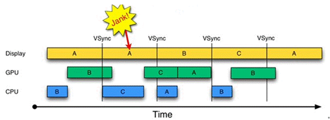
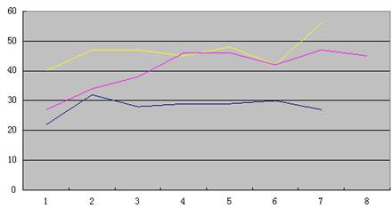

Android应用性能评测调优
----------------
> Android App各项性能如CPU、内存消耗等都是开发测试中需要关注的指标，如何将App打造的更加“优雅”是开发者们需要不断追求探索的方向，本文作者从内存和流畅度两个纬度来说说如何对Android App进行评测和调优。

## 前言 ##
在智能手机App竞争越来越激烈的今天，Android App各项性能如CPU、内存消耗等都是我们在开发测试中需要关注的指标，如何将App打造得更加“优雅”是我们需要不断追求探索的方向，下面我们从内存和流畅度两个纬度来说说如何对Android App进行评测和调优。

## 一、内存 ##
内存不是无限使用的，如果内存过大或泄漏会出现OOM（Out Of Memory）、UI不流畅等问题，因此内存也是一个稀缺资源，我们应该保证没有内存泄漏且对不需要使用的内存及时释放。一般内存测试或分析内存问题可以分为下面几步：

- 编译代码
- 选定测试场景（来自于经验&开发）
- 测试场景转换成用例
- 跑起工具Run用例

结合代码，分析，分析…

### 1. 内存测试通用的方法 ###
测试分析内存有以下几种方法：

- **DDMS（Heap&Allocation Tracker）**

Heap查看堆的分配情况：

主要关注两项数据：

1. Heap Size堆的大小，当资源增加，当前堆的空余空间不够时，系统会增加堆的大小。 
2. Allocated堆中已分配的大小，这是应用程序实际占用的内存大小，资源回收后，此项数据会变小。

**注：**如果进行反复操作，或堆的大小一直增加，则有内存泄漏的隐患。

Allocation Tracker跟踪内存分配情况：

- **MAT（Memory Analyzer）**

1. Leak Suspects：内存泄露报告 
2. Top Components：吃货报告 
3. Histogram：每个Class占用内存 
4. Dominator Tree：列出哪些对象占用内存最多以及谁hold住这些对象

### 2. Android常见的内存问题 ###
Android常见的内存问题有：

- **万恶的Static通常见到在单例模式**

下面就是一个例子，static变量占用过大的内存比例（7.1M），这里碰到该情况需要具体分析里面数据是否都是需要常驻的，不要把很多不相干的变量设为static属性。

- **多线程生命周期过长hold住本该释放资源**

这里需要自己搜索代码查看是哪里一直hold住了资源导致没有释放。

- **大胖子Bitmap**

图上可以看到Bitmap占用内存很大（5.7M），利用MAT来找到他的outgoing和incoming引用：

可以找到这块内存的引用关系，然后找代码。

在遇到图片资源占用过大的情况，建议：

1. 及时的销毁；
2. 设置一定的采样率；
3. 巧妙的运用软引用（SoftRefrence）。

- **Cursor**

Cursor用完记得关掉，如果实在不确定Cursor是否关闭，可以在onDestroy中关了。

> 总的来说，没有严格意义上泄露只是你hold太久。

## 二、流畅度 ##
对于App是否流畅这个维度，之前一直没有一个客观的数据来将用户客观感受和数据一一对应起来。虽然之前有FPS（每秒帧数）这个指标来衡量，不过这对于App这样的大部分时候可能没有界面更新的软件来说，是一个不恰当的客观数据（当然FPS用于游戏或视频类业务肯定是没问题的）。在和我们的浏览器团队沟通后，应他们的需求（它不仅要做最快的浏览器，同时也要做最流畅的浏览器），MIG（专项测试组）多位同学一起来通过研究Android自身UI更新机制以及通过数学建模摸索出一个客观数据指标流畅度（SM: SMoothness）来量化流畅度这个客观感受。

首先从下面开始…

### 1. Android如何绘制UI ###
关于Android是如何去更新UI的，我相信有很多文章来介绍其中步骤以及过程，大体上可以用下图来展示：

从图中可以看到，无论哪条路走下去始终都由SurfaceFlinger来控制最后更新。在Android版本更新过程中发现在Jelly Bean版本更新中，Google加入一个Project Butter来解决严重影响Android口碑问题之一的UI流畅性差的问题。而Project Butter中引入了三个核心元素，即VSync（垂直同步）、Triple Buffer和Choreographer。

### 2. 先VSync开始 ###
在Android 4.1（JB）中引入了VSync机制，是Vertical Synchronization（垂直同步）的缩写，是一种在PC上已经很早就广泛使用的技术，可以简单地把它认为是一种定时中断。

如上图所示在VSync机制下的绘制过程。从上面的图看**CPU和GPU处理时间都很快都少于一个VSync的间隔也就是16ms**，并且每个间隔都有绘制的情况下那么当前的FPS即是60帧。当CPU和GPU处理时间都很慢或者因为其他的原因，比如在主线程中干活太多那么就会出现如下图这样的状况。 

从上图可以看到CPU和GPU处理时间因为各种原因比较慢都大于一个VSync的间隔（16ms），那么可以看到在第二个VSync还在处理A区域的绘制这样就不可能实现理论上的FPS 60了同时也出现了丢帧（SF: Skipped Frame）。上图为了便于理解用的是双Buffer机制的情况，实际上Android 4.1在引入了Triple Buffer，所以当双Buffer不够用时Triple Buffer丢帧的情况如下图所示。 

Oh my ladygaga~~~这些把洒家看晕了…那打个比方讲得通俗点。

> VSync机制就像是一台转速固定的发动机（60转/s）。它每一转带动着去做一些UI相关的事情，但是不是每一转都会有工作去做（就像有时在空挡，有时在D档）。有时候因为各种阻力某一圈工作量比较重超过了16.6ms，那么这台发动机这秒内就不是60转了，当然也有可能被其他因素影响比如给油不足（主线程里干的活太多）等等。就会出现转速降低的状况我们把这个转速叫做流畅度。

### 3. 从FPS&丢帧到流畅度（SM: SMoothness） ###
**实际上在我们很多的Android App中，很少有需要不断地去绘制的场景，很多时候都是静态的。**也就是会出现这样的状况，虽然1s中VSync的60个Loop中不是每个都在做绘制的工作FPS比较低，但并不能代表这个时候程序不流畅（如我将App放在那不动实测FPS为1）。所以FPS为1这个数并不能代表当前App在UI上界面不流畅，因此1s内VSync这个Loop运行了多少次更加能说明当前App的流畅程度。So…另2个指标比FPS更加能代表当前的App是否处于流畅的状态同样这2个指标更加能够量化App卡顿的程度：

- 丢帧（SF: Skipped Frame）：如上图所示情况应该在16ms完成工作却因各种原因没做完，占了下n个16ms的时间，相当于丢了n帧。
- 流畅度（SM: SMoothness）：和丢帧相对，在VSync机制中1s内Loop运行的次数。 
1.和丢帧相对1s内有60个Loop因为某几次工作时间超过了16ms（丢帧），这样Loop就无法运行60次（理论最大值）。  
2.当流畅度越小的时候说明当前程序越卡顿。

### 4. 数数：如何得到流畅度（SM: SMoothness） ###
接着上面的结论如果在这样的机制下每次Loop运行之前通知我下，我就记个数就好了。

很幸运我们在新的Android的那一套机制中找到了一个画图的打杂工Choreographer这个对象。根据Google的官方API文档描述他是用来协调animations、input以及drawing时序的，并且每个Looper共用一个Choreographer对象。

Choreographer的定义和结构：

### 5. 所以通过如上原理分析可以得出结论： ###

- **根据了解文档发现Android 4.1引入了VSync机制可以通过其Loop来了解当前App最高绘制能力。**

1. 固定每隔16.6ms执行一次（这个值是一个静态变量会根据系统版本不同而采不同的值,目前测试版本是16.6ms这样最高的刷新的帧率就控制在60FPS以内）； 
2. 如果没有以上事件的时候同样也会运行这样一个Loop； 
3. 所以这个Loop在1s之内运行了多少次,即可以表示当前App绘制的最高的能力,也就是Android App卡顿的程度… 
4. 另，在一次Loop时如果执行时间超过了16.6ms，那么多于16.6ms的时间除以16.6ms，即是当前App的丢帧（SF: Skipped Frame）。

- **可以在Choreographer的回调FrameCallback中按秒计数表示当前App的流畅程度。**

采用这样方式就可以在App内部观测当前App的流畅度。当然，还有更简单的方法，采用GT工具获取流畅度，见下面步骤说明。

### 6. 用GT动态注入被测程序获取SM： ###
1）打开被测App，然后打开GT在插件中选择GT Injector：

2）选择被测进程&点击射它：

3）注入成功后Para界面会出现流畅度指标以及被插入程序的CPU占有率这些并且会带上被插入的进程名。将流畅度后面小方框勾选（表明记录SM值到log文件），然后点击Gather & Warning下小红圈（表明开始记录数值）。

4）开始做相关的测试测试。

5）完成测试后在刚才的界面点击流畅度（SM）出现下列界面，然后点击磁盘图标，保存log到指定名字的文件夹。

6）最后利用各种工具（比如应用宝）把log导入到PC端进行后期处理（文件保存在SD卡/GT/GW/进程名/自定义文件夹名下）。 

**注：**以上的操作因为涉及到进程注入需要手机Root权限，如果不能使用可以邮件给我，地址见文章末尾处。

### 7. 那么SM实际的测试效果如何？ ###
所以，我们拿a、b、c三个浏览器为例，对比评测下这样的数据和人感受是否对应得上。首先，我们为了把感官和人的感受对应上特把主动感官分数对应到以下几种描述如下表：

**场景1. 浏览妹子图……看看流畅度（SM）和丢帧（SF）之间关系**

来看看流畅度（SM）和丢帧（SF）之间关系…这个数据是用浏览器浏览妹子图时采集。因为丢帧是个不连续的过程，所以后面的图中丢帧都是以点来表示其离散的状态。

从上面图可以看出：
- 丢帧（SF）越多流畅度（SM）越低…
- 26:16秒后到26:42之间流畅度很低并且丢帧最密集，在这段期间流畅度主观评分在2.5。
- 再看看这期间流畅度，丢帧和主观的对应关系：

从这个数据可以看到丢帧（SF）越多流畅度（SM）越低，并且主观感觉是比较卡的（界面滑动明显顿挫感，响应用户输入有种慢半拍的感觉）。

**场景2. 看妹子图……引入FPS看看这3者关系…**

同样这段看妹子的过程中主观感受也是在2.5分：

这个数据里面引入了FPS数据。从上图可以看出：

- 虽然FPS曲线和SM曲线差不多而且同样受丢帧的影响；
- 里面有几段比较奇怪的地方：

1）流畅度很高FPS比较低，无丢帧情况…当时静置在某个界面没有动此时主观评分应该在4.5左右； 
2）FPS比较高，丢帧很严重流畅度很低…当时在不断刷新很多图片出来主观评分应该在2.0以下。

**把这2部分数据放大看：**

流畅度很高FPS比较低无丢帧：

本场景数据统计： 

这个局部场景虽然画面一直在动，没有丢帧FPS在20以下但是流畅度比较高。So…从次场景可以看出这样流畅度SM比FPS更加适合来客观描述Android App卡的程度。

### 8. 问题来了：这么多数据实在hold不住 ###
从上面可以看出数据量比较大而且几个产品条曲线之间有交错那如何评定哪个在某些场景下更好呢？于是我们就想：通过SM数据判断App流畅情况，并给出一个定量的结果。

**思路：**

1. 不能直接用平均值和方差。根据以往经验，通过平均值、方差等一些指标，并不好说明问题。如果卡顿时间出现较短，测试时间较长，则平均值和方差这种指标不容易发现问题，但是又确实有卡顿。平均值和方差适合描述服从正态分布的随机变量，但是测试得到的SM值并不是这样的随机变量。
2. 将测试结果按卡顿和流畅分段，对每个卡顿区间段打分。参考了KM上一篇游戏流畅度评分的文章，该文章结合FPS平均值和卡顿的程度以及频率，对游戏整体流畅度打分。但是普通App和游戏区别还是比较大的。对普通App来说，用户不是一直在操作，不同的操作差异也较大，因此卡顿的频率一般较低，用平均值和卡顿的频率打分得到的结果可能会偏高。所以把测试过程按照卡顿和流畅分段，计算每个卡顿区间的打分和持续时间可能更有参考意义。
3. 总体打分时加大卡顿时的权重，降低流畅区间的权重。虽然我们重点关注的可能是卡顿的地方，但是竞品测试，以及两个版本对比又需要有总体评判结果，不能只看局部。为了加大结果的区分度，对卡顿区间增加权重，对流畅区间降低权重。突出卡顿对整体评分的影响。因此，评估结果将包括两部分：总体打分以及卡顿区间，流畅区间的持续时间和打分。 

**流畅度评估方法：**

1.预处理，每5个（秒）一组，取最低值。如果5秒内出现多于一次卡顿（SM低于40），则再乘以一个和卡顿次数有关的权值（小于1）。说明：如果卡顿出现次数较少，平均值和方差不容易发现问题。因此没有直接对数据评估，先进行了预处理，突出SM值低的部分，加大卡顿对总分的影响。

处理前三组数据：

处理后三组数据： 

2.将处理后的数据按卡顿和流畅分段，针对每段打分。说明：如果只有最后总分，且流畅的时间较长，卡顿的数据容易被流畅的数据淹没。而且有些测试场景存在一段流畅，一段卡顿的现象，卡顿并不一定在整个测试过程中存在。这样分开流畅和卡顿的区间处 理，更容易看出卡顿的程度。

3.根据测试经验，对SM值对应的卡顿严重程度打分。说明：根据测试同学的经验，流畅度指标SM低于40时，用户能感知到卡顿，SM在20以下卡顿比较严重。因此在打分时，SM值在20以下时打分最低，对应0-20，在20-30区间打分低，对应20-60，30-40区间打 分较低，对应60-70，40以上打分在70以上。

4.总体打分时降低流畅区间的权重。说明：这样处理的原因和第一项的原因一样，我们更关注的是卡顿，流畅区间过长时会淹没卡顿的数据。

然后我们拿同一个测试场景下的测试数据出来对比一下：

1）网页滑动（Nexus 4上测试）：

测试方法：打开某网站，来回上下滑动，在滑动的过程中记录流畅度数据。

流畅度评估数据： 

从上面的数据可以看出滑动浏览网页的时候，其中c浏览器略微好于其他两个。当然这都是在性能比较好的手机（N4）上测试主观感受差距不大但是从量化数据上可以看出优劣。评分差距就和主观感受拉开分值差不多能对应上，从客观上可以证明这套评分算法某种程度上的准确性。