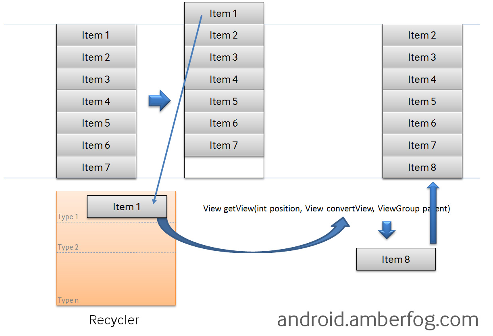

Android性能优化之:内存优化建议
====

* [Android官方优化篇](#google)
* [Android资源优化篇](#resource)
* [java代码优化篇](#Java)


<a name="google"/>
## Android官方篇[.](http://androidperformance.com/2015/07/20/Android-Performance-Memory-Google/) ##
为了使垃圾回收器可以正常释放程序所占用的内存，在编写代码的时候就一定要注意尽量避免出现内存泄漏的情况（通常都是由于全局成员变量持有对象引用所导致的），并且在适当的时候去释放对象引用。对于大多数的应用程序而言，后面其它的事情就可以都交给垃圾回收器去完成了，如果一个对象的引用不再被其它对象所持有，那么系统就会将这个对象所分配的内存进行回收。

我们在开发软件的时候应当自始至终都把内存的问题充分考虑进去，这样的话才能开发出更加高性能的软件。而内存问题也并不是无规律可行的，Android系统给我们提出了很多内存优化的建议技巧，只要按照这些技巧来编写程序，就可以让我们的程序在内存性能发面表现得相当不错。

> 本文原文来自Android开发者官网[Managing Your App’s Memory](http://developer.android.com/training/articles/memory.html)章节中的
[How Your App Should Manage Memory](http://developer.android.com/training/articles/memory.html#YourApp)部分。是Android官方帮助应用开发者更好地管理应用的内存而写的。作为一个应用程序开发者，你需要在你开发应用程序的时时刻刻都考虑内存问题。

### 1. 节制地使用Service ###
如果应用程序当中需要使用Service来执行后台任务的话，请一定要注意只有当任务正在执行的时候才应该让Service运行起来。另外，当任务执行完之后去停止Service的时候，要小心Service停止失败导致内存泄漏的情况。

当我们启动一个Service时，系统会倾向于将这个Service所依赖的进程进行保留，这样就会导致这个进程变得非常消耗内存。并且，系统可以在LRU cache当中缓存的进程数量也会减少，导致切换应用程序的时候耗费更多性能。严重的话，甚至有可能会导致崩溃，因为系统在内存非常吃紧的时候可能已无法维护所有正在运行的Service所依赖的进程了。

为了能够控制Service的生命周期，Android官方推荐的最佳解决方案就是使用[IntentService](http://developer.android.com/reference/android/app/IntentService.html)，这种Service的最大特点就是当后台任务执行结束后会自动停止，从而极大程度上避免了Service内存泄漏的可能性。

让一个Service在后台一直保持运行，即使它并不执行任何工作，这是编写Android程序时最糟糕的做法之一。所以Android官方极度建议开发人员们不要过于贪婪，让Service在后台一直运行，这不仅可能会导致手机和程序的性能非常低下，而且被用户发现了之后也有可能直接导致我们的软件被卸载

### 2. 当界面不可见时释放内存 ###
当用户打开了另外一个程序，我们的程序界面已经不再可见的时候，我们应当将所有和界面相关的资源进行释放。在这种场景下释放资源可以让系统缓存后台进程的能力显著增加，因此也会让用户体验变得更好。
那么我们如何才能知道程序界面是不是已经不可见了呢？其实很简单，只需要在Activity中重写`onTrimMemory()`方法([具体介绍](https://github.com/maguohui/Android-Excellent-Articles/blob/master/Android-Performance-Patterns-Analysis/android-performance-onTrimMemory))，然后在这个方法中监听TRIM_MEMORY_UI_HIDDEN这个级别，一旦触发了之后就说明用户已经离开了我们的程序，那么此时就可以进行资源释放操作了，如下所示：

```java
@Override  
public void onTrimMemory(int level) {  
    super.onTrimMemory(level);  
    switch (level) {  
    case TRIM_MEMORY_UI_HIDDEN:  
        // 进行资源释放操作  
        break;  
    }  
}
```

**注意** onTrimMemory()方法中的TRIM_MEMORY_UI_HIDDEN回调只有当我们程序中的所有UI组件全部不可见的时候才会触发，这和onStop()方法还是有很大区别的，因为onStop()方法只是当一个Activity完全不可见的时候就会调用，比如说用户打开了我们程序中的另一个Activity。因此，我们可以在onStop()方法中去释放一些Activity相关的资源，比如说取消网络连接或者注销广播接收器等，但是像UI相关的资源应该一直要等到onTrimMemory(TRIM_MEMORY_UI_HIDDEN)这个回调之后才去释放，这样可以保证如果用户只是从我们程序的一个Activity回到了另外一个Activity，界面相关的资源都不需要重新加载，从而提升响应速度。

### 3.当内存紧张时释放内存 ###
除了刚才讲的**TRIM_MEMORY_UI_HIDDEN**这个回调，onTrimMemory()方法还有很多种其它类型的回调，可以在手机内存降低的时候及时通知我们。我们应该根据回调中传入的级别来去决定如何释放应用程序的资源：

#### 3.1 应用程序正在运行时 ####
* **TRIM_MEMORY_RUNNING_MODERATE** 表示应用程序正常运行，并且不会被杀掉。但是目前手机的内存已经有点低了，系统可能会开始根据LRU缓存规则来去杀死进程了。
* **TRIM_MEMORY_RUNNING_LOW** 表示应用程序正常运行，并且不会被杀掉。但是目前手机的内存已经非常低了，我们应该去释放掉一些不必要的资源以提升系统的性能，同时这也会直接影响到我们应用程序的性能。
* **TRIM_MEMORY_RUNNING_CRITICAL** 表示应用程序仍然正常运行，但是系统已经根据LRU缓存规则杀掉了大部分缓存的进程了。这个时候我们应当尽可能地去释放任何不必要的资源，不然的话系统可能会继续杀掉所有缓存中的进程，并且开始杀掉一些本来应当保持运行的进程，比如说后台运行的服务。

#### 3.2 应用程序被缓存 ####
* **TRIM_MEMORY_BACKGROUND** 表示手机目前内存已经很低了，系统准备开始根据LRU缓存来清理进程。这个时候我们的程序在LRU缓存列表的最近位置，是不太可能被清理掉的，但这时去释放掉一些比较容易恢复的资源能够让手机的内存变得比较充足，从而让我们的程序更长时间地保留在缓存当中，这样当用户返回我们的程序时会感觉非常顺畅，而不是经历了一次重新启动的过程。
* **TRIM_MEMORY_MODERATE** 表示手机目前内存已经很低了，并且我们的程序处于LRU缓存列表的中间位置，如果手机内存还得不到进一步释放的话，那么我们的程序就有被系统杀掉的风险了。
* **TRIM_MEMORY_COMPLETE** 表示手机目前内存已经很低了，并且我们的程序处于LRU缓存列表的最边缘位置，系统会最优先考虑杀掉我们的应用程序，在这个时候应当尽可能地把一切可以释放的东西都进行释放。

因为onTrimMemory()是在 **API14** 才加进来的，所以如果要支持API14之前的话，则可以考虑 [onLowMemory()](http://developer.android.com/reference/android/content/ComponentCallbacks.html#onLowMemory())这个方法，它粗略的相等于onTrimMemory()回调的TRIM_MEMORY_COMPLETE事件。

> 注意：当系统安装LRU cache杀进程的时候，尽管大部分时间是从下往上按顺序杀，有时候系统也会将占用内存比较大的进程纳入被杀范围，以尽快得到足够的内存。所以你的应用在LRU list中占用的内存越少，你就越能避免被杀掉，当你恢复的时候也会更快。

### 4. 检查你应该使用多少的内存 ###
正如前面提到的，每一个Android设备都会有不同的RAM总大小与可用空间，因此不同设备为app提供了不同大小的heap限制。你可以通过调用[getMemoryClass()](http://developer.android.com/reference/android/app/ActivityManager.html#getMemoryClass()来获取你的app的可用heap大小。如果你的app尝试申请更多的内存，会出现 **OutOfMemory** 的错误。

在一些特殊的情景下，你可以通过在manifest的application标签下添加largeHeap=true的属性来声明一个更大的heap空间。如果你这样做，你可以通过 [getLargeMemoryClass()](http://developer.android.com/reference/android/app/ActivityManager.html#getLargeMemoryClass() 来获取到一个更大的heap size。

然而，能够获取更大heap的设计本意是为了一小部分会消耗大量RAM的应用(例如一个大图片的编辑应用)。**不要轻易的因为你需要使用大量的内存而去请求一个大的heap size。** 只有当你清楚的知道哪里会使用大量的内存并且为什么这些内存必须被保留时才去使用large heap. 因此请尽量少使用large heap。使用额外的内存会影响系统整体的用户体验，并且会使得GC的每次运行时间更长。在任务切换时，系统的性能会变得大打折扣。

另外, large heap并不一定能够获取到更大的heap。在某些有严格限制的机器上，large heap的大小和通常的heap size是一样的。因此即使你申请了large heap，你还是应该通过执行getMemoryClass()来检查实际获取到的heap大小。

### 5. 避免在Bitmap上浪费内存 ###
当我们读取一个Bitmap图片的时候，有一点一定要注意，就是千万不要去加载不需要的分辨率。在一个很小的ImageView上显示一张高分辨率的图片不会带来任何视觉上的好处，但却会占用我们相当多宝贵的内存。需要仅记的一点是，将一张图片解析成一个Bitmap对象时所占用的内存并不是这个图片在硬盘中的大小，可能一张图片只有100k你觉得它并不大，但是读取到内存当中是按照像素点来算的，比如这张图片是15001000像素，使用的ARGB_8888颜色类型，那么每个像素点就会占用4个字节，总内存就是15001000*4字节，也就是5.7M，这个数据看起来就比较恐怖了。

### 6. 使用优化过的数据集合 ###
利用Android Framework里面优化过的容器类，例如[SparseArray](http://developer.android.com/reference/android/util/SparseArray.html), [SparseBooleanArray](http://developer.android.com/reference/android/util/SparseBooleanArray.html), 与 [LongSparseArray](http://developer.android.com/reference/android/support/v4/util/LongSparseArray.html)。 通常的HashMap的实现方式更加消耗内存，因为它需要一个额外的实例对象来记录Mapping操作。另外，SparseArray更加高效在于他们避免了对key与value的autobox自动装箱，并且避免了装箱后的解箱。

### 7. 知晓内存的开支情况 ###
我们还应当清楚我们所使用语言的内存开支和消耗情况，并且在整个软件的设计和开发当中都应该将这些信息考虑在内。可能有一些看起来无关痛痒的写法，结果却会导致很大一部分的内存开支，例如：

* 使用枚举通常会比使用静态常量要消耗两倍以上的内存，在Android开发当中我们应当尽可能地不使用枚举。
* 任何一个Java类，包括内部类、匿名类，都要占用大概500字节的内存空间。
* 任何一个类的实例要消耗12-16字节的内存开支，因此频繁创建实例也是会一定程序上影响内存的。
* 在使用HashMap时，即使你只设置了一个基本数据类型的键，比如说int，但是也会按照对象的大小来分配内存，大概是32字节，而不是4字节。因此最好的办法就是像上面所说的一样，使用优化过的数据集合。

### 8. 谨慎使用抽象编程 ###
许多程序员都喜欢各种使用抽象来编程，认为这是一种很好的编程习惯。当然，这一点不可否认，因为的抽象的编程方法更加面向对象，而且在代码的维护和可扩展性方面都会有所提高。但是，在Android上使用抽象会带来额外的内存开支，因为抽象的编程方法需要编写额外的代码，虽然这些代码根本执行不到，但是却也要映射到内存当中，不仅占用了更多的内存，在执行效率方面也会有所降低。当然这里我并不是提倡大家完全不使用抽象编程，而是谨慎使用抽象编程，不要认为这是一种很酷的编程方式而去肆意使用它，只在你认为有必要的情况下才去使用。

### 9. 为序列化的数据使用nano protobufs ###
[Protocol buffers](https://developers.google.com/protocol-buffers/docs/overview)是由Google为序列化结构数据而设计的，一种语言无关，平台无关，具有良好扩展性的协议。类似XML，却比XML更加轻量，快速，简单。如果你需要为你的数据实现协议化，你应该在客户端的代码中总是使用nano protobufs。通常的协议化操作会生成大量繁琐的代码，这容易给你的app带来许多问题：增加RAM的使用量，显著增加APK的大小，更慢的执行速度，更容易达到DEX的字符限制。

关于更多细节，请参考[protobuf readme](https://android.googlesource.com/platform/external/protobuf/+/master/java/README.txt)的”Nano version”章节。

### 10. 尽量避免使用依赖注入框架 ###
现在有很多人都喜欢在Android工程当中使用依赖注入框架，比如说像Guice或者RoboGuice等，因为它们可以简化一些复杂的编码操作，比如可以将下面的一段代码：

```java
class AndroidWay extends Activity {   
    TextView name;   
    ImageView thumbnail;   
    LocationManager loc;   
    Drawable icon;   
    String myName;   
  
    public void onCreate(Bundle savedInstanceState) {   
        super.onCreate(savedInstanceState);   
        setContentView(R.layout.main);  
        name      = (TextView) findViewById(R.id.name);   
        thumbnail = (ImageView) findViewById(R.id.thumbnail);   
        loc       = (LocationManager) getSystemService(Activity.LOCATION_SERVICE);   
        icon      = getResources().getDrawable(R.drawable.icon);   
        myName    = getString(R.string.app_name);   
        name.setText( "Hello, " + myName );   
    }   
}
```

简化成这样的一种写法：

```java
@ContentView(R.layout.main)  
class RoboWay extends RoboActivity {   
    @InjectView(R.id.name)             TextView name;   
    @InjectView(R.id.thumbnail)        ImageView thumbnail;   
    @InjectResource(R.drawable.icon)   Drawable icon;   
    @InjectResource(R.string.app_name) String myName;   
    @Inject                            LocationManager loc;   
  
    public void onCreate(Bundle savedInstanceState) {   
        super.onCreate(savedInstanceState);   
        name.setText( "Hello, " + myName );   
    }   
}
```

看上去确实十分诱人，我们甚至可以将findViewById()这一类的繁琐操作全部省去了。但是这些框架为了要搜寻代码中的注解，通常都需要经历较长的初始化过程，并且还可能将一些你用不到的对象也一并加载到内存当中。这些用不到的对象会一直占用着内存空间，可能要过很久之后才会得到释放，相较之下，也许多敲几行看似繁琐的代码才是更好的选择。

### 11. 谨慎使用external libraries ###
很多External library的代码都不是为移动网络环境而编写的，在移动客户端则显示的效率不高。至少，当你决定使用一个external library的时候，你应该针对移动网络做繁琐的porting与maintenance的工作。

即使是针对Android而设计的library，也可能是很危险的，因为每一个library所做的事情都是不一样的。例如，其中一个lib使用的是nano protobufs, 而另外一个使用的是micro protobufs。那么这样，在你的app里面就有2种protobuf的实现方式。这样的冲突同样可能发生在输出日志，加载图片，缓存等等模块里面。

同样不要陷入为了1个或者2个功能而导入整个library的陷阱。如果没有一个合适的库与你的需求相吻合，你应该考虑自己去实现，而不是导入一个大而全的解决方案。

### 12. 优化整体性能 ###
官方有列出许多优化整个app性能的文章：[Best Practices for Performance](http://developer.android.com/training/best-performance.html). 这篇文章就是其中之一。有些文章是讲解如何优化app的CPU使用效率，有些是如何优化app的内存使用效率。

你还应该阅读[optimizing your UI](http://developer.android.com/tools/debugging/debugging-ui.html)来为layout进行优化。同样还应该关注lint工具所提出的建议，进行优化。

### 13. 使用ProGuard来剔除不需要的代码 ###
[ProGuard](http://developer.android.com/tools/help/proguard.html)能够通过移除不需要的代码，重命名类，域与方法等方对代码进行压缩，优化与混淆。使用ProGuard可以是的你的代码更加紧凑，这样能够使用更少mapped代码所需要的RAM。

### 14. 对最终的APK使用zipalign ###
在编写完所有代码，并通过编译系统生成APK之后，你需要使用 [zipalign](http://developer.android.com/tools/help/zipalign.html) 对APK进行重新校准。如果你不做这个步骤，会导致你的APK需要更多的RAM，因为一些类似图片资源的东西不能被mapped。

**Notes:** Google Play不接受没有经过zipalign的APK。

### 15. 分析你的RAM使用情况 ###
一旦你获取到一个相对稳定的版本后，需要分析你的app整个生命周期内使用的内存情况，并进行优化，更多细节请参考[Investigating Your RAM Usage](http://developer.android.com/tools/debugging/debugging-memory.html).

### 16. 使用多进程 ###
如果合适的话，有一个更高级的技术可以帮助你的app管理内存使用：通过把你的app组件切分成多个组件，运行在不同的进程中。这个技术必须谨慎使用，大多数app都不应该运行在多个进程中。因为如果使用不当，它会显著增加内存的使用，而不是减少。当你的app需要在后台运行与前台一样的大量的任务的时候，可以考虑使用这个技术。

一个典型的例子是创建一个可以长时间后台播放的Music Player。如果整个app运行在一个进程中，当后台播放的时候，前台的那些UI资源也没有办法得到释放。类似这样的app可以切分成2个进程：一个用来操作UI，另外一个用来后台的Service.

你可以通过在manifest文件中声明’android:process’属性来实现某个组件运行在另外一个进程的操作。

```xml
<service android:name=".PlaybackService"
         android:process=":background" />
```

更多关于使用这个技术的细节，请参考原文，链接如下。
[http://developer.android.com/training/articles/memory.html](http://developer.android.com/training/articles/memory.html)


<a name="resource"/>
## Android资源篇[.](http://androidperformance.com/2015/07/20/Android-Performance-Memory-AndroidResource/) ##
主要介绍在实际Android应用程序的开发中，容易导致内存泄露的一些情况。开发人员如果在进行代码编写之前就有内存泄露方面的基础知识，那么写出来的代码会强壮许多，写这篇文章也是这个初衷。本文从Android开发中的资源使用情况入手，介绍了如何在Bitmap、数据库查询、9-patch、过渡绘制等方面优化内存的使用。

### 1. Bitmap优化 ###
Android中的大部分内存问题归根结底都是Bitmap的问题，如果打开MAT(Memory analyzer tool)来看，实际占用内存大的都是一些Bitmap(以byte数组的形式存储)。所以Bitmap的优化应该是我们着重去解决的。Google在其官方有针对Bitmap的使用专门写了一个专题 : [Displaying Bitmaps Efficiently](http://developer.android.com/training/displaying-bitmaps/index.html), 对应的中文翻译在 ：[displaying-bitmaps](https://github.com/kesenhoo/android-training-course-in-chinese/tree/master/graphics/displaying-bitmaps) , 在优化Bitmap资源之前，请先看看这个系列的文档，以确保自己正确地使用了Bitmap。

Bitmap如果没有被释放，那么一般只有两个问题：

* 用户在使用完这个Bitmap之后，没有主动去释放Bitmap资源。
* 这个Bitmap资源被引用所以无法被释放 。

#### 1.1 主动释放Bitmap资源 ####
当你确定这个Bitmap资源不会再被使用的时候(当然这个Bitmap不释放可能会让程序下一次启动或者resume快一些，但是其占用的内存资源太大，可能导致程序在后台的时候被杀掉，反而得不偿失)，我们建议手动调用recycle()方法，释放其Native内存：

```java
if(bitmap != null && !bitmap.isRecycled()){  
    bitmap.recycle(); 
    bitmap = null; 
}
```

我们也可以看一下Bitmap.java中recycle()方法的说明：

```java
/**
     * Free the native object associated with this bitmap, and clear the
     * reference to the pixel data. This will not free the pixel data synchronously;
     * it simply allows it to be garbage collected if there are no other references.
     * The bitmap is marked as "dead", meaning it will throw an exception if
     * getPixels() or setPixels() is called, and will draw nothing. This operation
     * cannot be reversed, so it should only be called if you are sure there are no
     * further uses for the bitmap. This is an advanced call, and normally need
     * not be called, since the normal GC process will free up this memory when
     * there are no more references to this bitmap.
     */
    public void recycle() {
        if (!mRecycled) {
            if (nativeRecycle(mNativeBitmap)) {
                // return value indicates whether native pixel object was actually recycled.
                // false indicates that it is still in use at the native level and these
                // objects should not be collected now. They will be collected later when the
                // Bitmap itself is collected.
                mBuffer = null;
                mNinePatchChunk = null;
            }
            mRecycled = true;
        }
    }

......
//如果使用过程中抛出异常的判断
if (bitmap.isRecycled()) {
    throw new RuntimeException("Canvas: trying to use a recycled bitmap " + bitmap);
}
```

调用bitmap.recycle之后，这个Bitmap如果没有被引用到，那么就会被垃圾回收器回收。如果不主动调用这个方法，垃圾回收器也会进行回收工作，只不过垃圾回收器的不确定性太大，依赖其自动回收不靠谱(比如垃圾回收器一次性要回收好多Bitmap，那么需要的时间就会很多，导致回收的时候会卡顿)。所以我们需要主动调用recycle。

#### 1.2 主动释放ImageView的图片资源 ####
由于我们在实际开发中，很多情况是在xml布局文件中设置ImageView的src或者在代码中调用ImageView.setImageResource/setImageURI/setImageDrawable等方法设置图像，下面代码可以回收这个ImageView所对应的资源：

```java
private static void recycleImageViewBitMap(ImageView imageView) {
    if (imageView != null) {
        BitmapDrawable bd = (BitmapDrawable) imageView.getDrawable();
        rceycleBitmapDrawable(bd);
    }
}

private static void rceycleBitmapDrawable(BitmapDrawable bitmapDrawable) {
    if (bitmapDrawable != null) {
        Bitmap bitmap = bitmapDrawable.getBitmap();
        rceycleBitmap(bitmap);
    }
    bitmapDrawable = null;
}

private static void rceycleBitmap(Bitmap bitmap) {
    if (bitmap != null && !bitmap.isRecycled()) {
        bitmap.recycle();
        bitmap = null;
    }
}
```

#### 1.3 主动释放ImageView的背景资源 ####
如果你的ImageView是有Background，那么下面的代码可以释放他：

```java
public static void recycleBackgroundBitMap(ImageView view) {
    if (view != null) {
        BitmapDrawable bd = (BitmapDrawable) view.getBackground();
        rceycleBitmapDrawable(bd);
    }
}

public static void recycleImageViewBitMap(ImageView imageView) {
    if (imageView != null) {
        BitmapDrawable bd = (BitmapDrawable) imageView.getDrawable();
        rceycleBitmapDrawable(bd);
    }
}

private static void rceycleBitmapDrawable(BitmapDrawable bitmapDrawable) {
    if (bitmapDrawable != null) {
        Bitmap bitmap = bitmapDrawable.getBitmap();
        rceycleBitmap(bitmap);
    }
    bitmapDrawable = null;
}
```

#### 1.4 尽量少用Png图，多用NinePatch的图 ####
现在手机的分辨率越来越高，图片资源在被加载后所占用的内存也越来越大，所以要尽量避免使用大的PNG图，在产品设计的时候就要尽量避免用一张大图来进行展示，尽量多用NinePatch资源。

Android中的NinePatch指的是一种拉伸后不会变形的特殊png图，NinePatch的拉伸区域可以自己定义。这种图的优点是体积小，拉伸不变形，可以适配多机型。Android SDK中有自带NinePatch资源制作工具，Android-Studio中在普通png图片点击右键可以将其转换为NinePatch资源，使用起来非常方便。


#### 1.5 使用大图之前，尽量先对其进行压缩 ####
图片有不同的形状与大小。在大多数情况下它们的实际大小都比需要呈现出来的要大很多。例如，系统的Gallery程序会显示那些你使用设备camera拍摄的图片，但是那些图片的分辨率通常都比你的设备屏幕分辨率要高很多。

考虑到程序是在有限的内存下工作，理想情况是你只需要在内存中加载一个低分辨率的版本即可。这个低分辨率的版本应该是与你的UI大小所匹配的，这样才便于显示。一个高分辨率的图片不会提供任何可见的好处，却会占用宝贵的(precious)的内存资源，并且会在快速滑动图片时导致(incurs)附加的效率问题。

Google官网的Training中，有一篇文章专门介绍如何有效地加载大图，里面提到了两个比较重要的技术：

* 在图片加载前获取其宽高和类型
* 加载一个按比例缩小的版本到内存中

原文地址：[Loading Large Bitmaps Efficiently](http://developer.android.com/training/displaying-bitmaps/load-bitmap.html#read-bitmap),中文翻译地址：[有效地加载大尺寸位图](https://github.com/kesenhoo/android-training-course-in-chinese/blob/master/graphics/displaying-bitmaps/load-bitmap.md)，强烈建议每一位Android开发者都去看一下，并在自己的实际项目中使用到。

更多关于Bitmap的使用和优化，可以参考Android官方Training专题的[displaying-bitmaps](http://developer.android.com/training/displaying-bitmaps/index.html)

### 2 查询数据库没有关闭游标 ###
程序中经常会进行查询数据库的操作，但是经常会有使用完毕Cursor后没有关闭的情况。如果我们的查询结果集比较小，对内存的消耗不容易被发现，只有在常时间大量操作的情况下才会复现内存问题，这样就会给以后的测试和问题排查带来困难和风险。
示例代码：

```java
Cursor cursor = getContentResolver().query(uri ...);
	if (cursor.moveToNext()) {
 	... ... 
}
```

修正示例代码:

```java
Cursor cursor = null;
try {
  	cursor = getContentResolver().query(uri ...);
	if (cursor != null && cursor.moveToNext()) {
	... ... 
	}
	} finally {
		if (cursor != null) {
	try { 
		cursor.close();
	} catch (Exception e) {
		//ignore this
		}
	}
}
```

### 3 构造Adapter时，没有使用缓存的convertView ###
以构造ListView的BaseAdapter为例，在BaseAdapter中提供了方法：

```java
public View getView(int position, View convertView, ViewGroup parent)
```

来向ListView提供每一个item所需要的view对象。初始时ListView会从BaseAdapter中根据当前的屏幕布局实例化一定数量的view对象，同时ListView会将这些view对象缓存起来。当向上滚动ListView时，原先位于最上面的list item的view对象会被回收，然后被用来构造新出现的最下面的list item。这个构造过程就是由getView()方法完成的，getView()的第二个形参 View convertView就是被缓存起来的list item的view对象(初始化时缓存中没有view对象则convertView是null)。

由此可以看出，如果我们不去使用convertView，而是每次都在getView()中重新实例化一个View对象的话，即浪费资源也浪费时间，也会使得内存占用越来越大。ListView回收list item的view对象的过程可以查看:android.widget.AbsListView.java —> void addScrapView(View scrap) 方法。



示例代码：
```java
public View getView(int position, View convertView, ViewGroup parent) {
 View view = new Xxx(...);
 ... ...
 return view;
}
```

示例修正代码：

```java
public View getView(int position, View convertView, ViewGroup parent) {
 View view = null;
 if (convertView != null) {
 view = convertView;
 populate(view, getItem(position));
 ...
 } else {
 view = new Xxx(...);
 ...
 }
 return view;
}
```

关于ListView的使用和优化，可以参考这两篇文章：

* [Using lists in Android (ListView) - Tutorial](http://www.vogella.com/tutorials/AndroidListView/article.html)
* [Making ListView Scrolling Smooth](http://developer.android.com/training/improving-layouts/smooth-scrolling.html#ViewHolder)

### 4 释放对象的引用 ###
前面有说过，一个对象的内存没有被释放是因为他被其他的对象所引用，系统不回去释放这些有GC Root的对象。

示例A：</br>
假设有如下操作

```java
public class DemoActivity extends Activity {
	... ...
	private Handler mHandler = ...
	private Object obj;
	public void operation() {
	 obj = initObj();
	 ...
	 [Mark]
	 mHandler.post(new Runnable() {
	        public void run() {
	         useObj(obj);
	        }
	 });
	}
}
```

我们有一个成员变量 obj，在operation()中我们希望能够将处理obj实例的操作post到某个线程的MessageQueue中。在以上的代码中，即便是mHandler所在的线程使用完了obj所引用的对象，但这个对象仍然不会被垃圾回收掉，因为DemoActivity.obj还保有这个对象的引用。所以如果在DemoActivity中不再使用这个对象了，可以在[Mark]的位置释放对象的引用，而代码可以修改为：

```java
public void operation() {
	obj = initObj();
	...
	final Object o = obj;
	obj = null;
	mHandler.post(new Runnable() {
	    public void run() {
	        useObj(o);
	    }
	}
}
```

示例B：</br>
假设我们希望在锁屏界面(LockScreen)中，监听系统中的电话服务以获取一些信息(如信号强度等)，则可以在LockScreen中定义一个PhoneStateListener的对象，同时将它注册到TelephonyManager服务中。对于LockScreen对象，当需要显示锁屏界面的时候就会创建一个LockScreen对象，而当锁屏界面消失的时候LockScreen对象就会被释放掉。

但是如果在释放LockScreen对象的时候忘记取消我们之前注册的PhoneStateListener对象，则会导致LockScreen无法被垃圾回收。如果不断的使锁屏界面显示和消失，则最终会由于大量的LockScreen对象没有办法被回收而引起OutOfMemory,使得system_ui进程挂掉。

总之当一个生命周期较短的对象A，被一个生命周期较长的对象B保有其引用的情况下，在A的生命周期结束时，要在B中清除掉对A的引用。

使用MAT可以很方便地查看对象之间的引用.

### 5 在Activity的生命周期中释放资源 ###
Android应用程序中最典型的需要注意释放资源的情况是在Activity的生命周期中，在onPause()、onStop()、onDestroy()方法中需要适当的释放资源的情况。由于此情况很基础，在此不详细说明，具体可以查看官方文档对Activity生命周期的介绍，以明确何时应该释放哪些资源。

### 6 消除过渡绘制 ###
过渡绘制指的是在屏幕一个像素上绘制多次(超过一次),比如一个TextView后有背景，那么显示文本的像素至少绘了两次，一次是背景，一次是文本。GPU过度绘制或多或少对性能有些影响,设备的内存带宽是有限的，当过度绘制导致应用需要更多的带宽(超过了可用带宽)的时候性能就会降低。带宽的限制每个设备都可能是不一样的。

过渡绘制的原因:

1. 同一层级的View叠加
2. 复杂的层级叠加

减少过渡绘制能去掉一些无用的View，能有效减少GPU的负载，也可以减轻一部分内存压力。关于过渡绘制我专门写了一篇文章来介绍：[过渡绘制及其优化](https://github.com/maguohui/Android-Excellent-Articles/blob/master/Android-Performance-Patterns-Analysis/android-performance-optimization-overdraw)

### 7 使用Android系统自带的资源 ###
在Android应用开发过程中，屏幕上控件的布局代码和程序的逻辑代码通常是分开的。界面的布局代码是放在一个独立的xml文件中的，这个文件里面是树型组织的，控制着页面的布局。通常，在这个页面中会用到很多控件，控件会用到很多的资源。Android系统本身有很多的资源，包括各种各样的字符串、图片、动画、样式和布局等等，这些都可以在应用程序中直接使用。这样做的好处很多，既可以减少内存的使用，又可以减少部分工作量，也可以缩减程序安装包的大小。

比如下面的代码就是使用系统的ListView：

```java
<ListView 
    android:id="@android:id/list"
    android:layout_width="fill_parent"
    android:layout_height="fill_parent"/>
```

### 8 使用内存相关工具检测 ###
在开发中，不可能保证一次就开发出一个内存管理非常棒的应用，所以在开发的每一个阶段，都要有意识地去针对内存进行专门的检查。目前Android提供了许多布局、内存相关的工具，比如Lint、MAT等。学会这些工具的使用是一个Android开发者必不可少的技能。


<a name="java"/>
## Java官方篇[.](http://androidperformance.com/2015/07/20/Android-Performance-Memory-Java/) ##
主要是介绍了一些小细节的优化技巧，当这些小技巧综合使用起来的时候，对于整个App的性能提升还是有作用的，只是不能较大幅度的提升性能而已。选择合适的算法与数据结构才应该是你首要考虑的因素，在这篇文章中不会涉及这方面。你应该使用这篇文章中的小技巧作为平时写代码的习惯，这样能够提升代码的效率。

本文的原文为Google官方Training的性能优化部分，这一章节主要讲解的是高性能Android代码优化建议,建议所有Android应用开发者都仔细阅读这份文档，并将所提到的编码思想运用到实际的Android开发中。

> 原文地址：[http://developer.android.com/training/articles/perf-tips.html](http://developer.android.com/training/articles/perf-tips.html)

通常来说，高效的代码需要满足下面两个规则：

* 不要做冗余的动作
* 如果能避免，尽量不要分配内存

你会面临最棘手的一个问题是当你优化一个肯定会在多种类型的硬件上运行的应用程序。不同版本的VM在不同的处理器上运行速度不同。它甚至不是你可以简单地说“设备X因为F原因比设备Y快/慢”那么简单,而且也不能简单地从一个设备拓展到另一个设备。特别提醒的是模拟器在性能方面和其他的设备没有可比性。通常有JIT优化和没有JIT优化的设备之间存在巨大差异:经过JIT代码优化的设备并不一定比没有经过JIT代码优化的设备好。

代码的执行效果会受到设备CPU,设备内存,系统版本等诸多因素的影响。为了确保代码能够在不同设备上都运行良好，需要最大化代码的效率。

### 1 避免创建不必要的对象 ###
虽然GC可以回收不用的对象，可是为这些对象分配内存，并回收它们同样是需要耗费资源的。</br>
因此请尽量避免创建不必要的对象，有下面一些例子来说明这个问题：

* 如果你需要返回一个String对象，并且你知道它最终会需要连接到一个StringBuffer，请修改你的实现方式，避免直接进行连接操作，应该采用创建一个临时对象来做这个操作.
* 当从输入的数据集中抽取出Strings的时候，尝试返回原数据的substring对象，而不是创建一个重复的对象。

一个稍微激进点的做法是把所有多维的数据分解成1维的数组:

* 一组int数据要比一组Integer对象要好很多。可以得知，两组1维数组要比一个2维数组更加的有效率。同样的，这个道理可以推广至其他原始数据类型。
* 如果你需要实现一个数组用来存放(Foo,Bar)的对象，尝试分解为Foo[]与Bar[]要比(Foo,Bar)好很多。(当然，为了某些好的API的设计，可以适当做一些妥协。但是在自己的代码内部，你应该多多使用分解后的容易。

通常来说，需要避免创建更多的对象。更少的对象意味者更少的GC动作，GC会对用户体验有比较直接的影响。

### 2 选择Static而不是Virtual ###
如果你不需要访问一个对象的值域,请保证这个方法是static类型的,这样方法调用将快15%-20%。这是一个好的习惯，因为你可以从方法声明中得知调用无法改变这个对象的状态。

### 3 常量声明为Static Final ###
先看下面这种声明的方式

```java
static int intVal = 42;
static String strVal = "Hello, world!";
```

编译器会在类首次被使用到的时候，使用初始化`clinit`方法来初始化上面的值，之后访问的时候会需要先到它那里查找，然后才返回数据。我们可以使用static final来提升性能：

```java
static final int intVal = 42;
static final String strVal = "Hello, world!";
```

这时再也不需要上面的那个方法来做多余的查找动作了。</br>
**所以，请尽可能的为常量声明为static final类型的。**

### 4 避免内部的Getters/Setters ###
像C++等native language,通常使用getters(i = getCount())而不是直接访问变量(i = mCount).这是编写C++的一种优秀习惯，而且通常也被其他面向对象的语言所采用，例如C#与Java，因为编译器通常会做inline访问，而且你需要限制或者调试变量，你可以在任何时候在getter/setter里面添加代码。</br>
**然而，在Android上，这是一个糟糕的写法。** Virtual method的调用比起直接访问变量要耗费更多。那么合理的做法是：**在面向对象的设计当中应该使用getter/setter，但是在类的内部你应该直接访问变量。** </br>
没有 `JIT(Just In Time Compiler)` 时，直接访问变量的速度是调用getter的 **3** 倍。有JIT时,直接访问变量的速度是通过getter访问的 **7** 倍。</br>
**请注意**，如果你使用[ProGuard](http://developer.android.com/tools/help/proguard.html), 你可以获得同样的效果，因为ProGuard可以为你inline accessors.

### 5 使用增强的For循环写法 ###
请比较下面三种循环的方法：

```java
static class Foo {
    int mSplat;
}

Foo[] mArray = ...

public void zero() {
    int sum = 0;
    for (int i = 0; i < mArray.length; ++i) {
        sum += mArray[i].mSplat;
    }
}

public void one() {
    int sum = 0;
    Foo[] localArray = mArray;
    int len = localArray.length;

    for (int i = 0; i < len; ++i) {
        sum += localArray[i].mSplat;
    }
}

public void two() {
    int sum = 0;
    for (Foo a : mArray) {
        sum += a.mSplat;
    }
}
```

* zero()是最慢的，因为JIT没有办法对它进行优化。
* one()稍微快些。
* two() 在没有做JIT时是最快的，可是如果经过JIT之后，与方法one()是差不多一样快的。它使用了增强的循环方法for-each。

所以请尽量使用for-each的方法，但是对于ArrayList，请使用方法one()。

### 6 使用包级访问而不是内部类的私有访问 ###
参考下面一段代码

```java
public class Foo {
    private class Inner {
        void stuff() {
            Foo.this.doStuff(Foo.this.mValue);
        }
    }

    private int mValue;

    public void run() {
        Inner in = new Inner();
        mValue = 27;
        in.stuff();
    }

    private void doStuff(int value) {
        System.out.println("Value is " + value);
    }
}
```

这里重要的是，我们定义了一个私有的内部类（Foo$Inner），它直接访问了外部类中的私有方法以及私有成员对象。这是合法的，这段代码也会如同预期一样打印出”Value is 27”。

问题是，VM因为Foo和Foo$Inner是不同的类，会认为在Foo$Inner中直接访问Foo类的私有成员是不合法的。即使Java语言允许内部类访问外部类的私有成员。为了去除这种差异，编译器会产生一些仿造函数：

```java
/*package*/ static int Foo.access$100(Foo foo) {
    return foo.mValue;
}
/*package*/ static void Foo.access$200(Foo foo, int value) {
    foo.doStuff(value);
}
```

每当内部类需要访问外部类中的mValue成员或需要调用doStuff()函数时，它都会调用这些静态方法。这意味着，上面的代码可以归结为，通过accessor函数来访问成员变量。早些时候我们说过，通过accessor会比直接访问域要慢。所以，这是一个特定语言用法造成性能降低的例子。

如果你正在性能热区（hotspot:高频率、重复执行的代码段）使用像这样的代码，你可以把内部类需要访问的域和方法声明为包级访问，而不是私有访问权限。不幸的是，这意味着在相同包中的其他类也可以直接访问这些域，所以在公开的API中你不能这样做。

### 7 避免使用float类型 ###
Android系统中float类型的数据存取速度是int类型的一半，尽量优先采用int类型。

### 8 使用库函数 ###
尽量使用System.arraycopy()等一些封装好的库函数，它的效率是手动编写copy实现的9倍多。

**Tip: Also see Josh Bloch’s Effective Java, item 47.**

### 9 谨慎使用native函数 ###
当你需要把已经存在的native code迁移到Android，请谨慎使用JNI。如果你要使用JNI,请学习[JNI Tips](http://developer.android.com/guide/practices/jni.html)

### 10 关于性能的误区 ###
在没有做JIT之前，使用一种确切的数据类型确实要比抽象的数据类型速度要更有效率。(例如，使用HashMap要比Map效率更高。) 有误传效率要高一倍，实际上只是6%左右。而且，在JIT之后，他们直接并没有大多差异。

### 11 关于测量 ###
上面文档中出现的数据是Android的实际运行效果。我们可以用 [Traceview](http://developer.android.com/tools/debugging/debugging-tracing.html) 来测量，但是测量的数据是没有经过JIT优化的，所以实际的效果应该是要比测量的数据稍微好些。

关于如何测量与调试，还可以参考下面两篇文章：

* [Profiling with Traceview and dmtracedump](http://developer.android.com/tools/debugging/debugging-tracing.html)
* [Analysing Display and Performance with Systrace](http://developer.android.com/tools/debugging/systrace.html)


