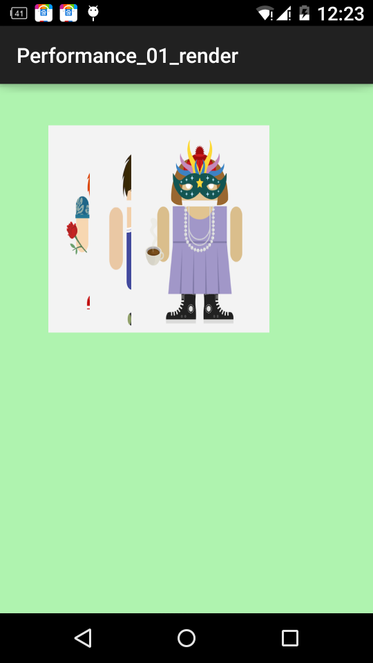

Android性能优化之: UI性能优化实战-识别绘制中的性能问题
---

## 1、概述
2015年初google发布了 **Android性能优化典范** ，发了16个小视频供大家欣赏，那么近期google又在udacity上开了系列类的相关课程。有了上述的参考，那么本性能优化实战教程就有了坚实的基础，本系列将结合实例为大家展示如何去识别、诊断、解决Android应用开发中存在的性能问题。那么首先带来的就是大家最关注的渲染的性能优化（~~渲染就是把东西绘制到屏幕上）。

>本文章所有案例可能并不会完全按照Google给出的例子，因为范例代码比较多且不好在文章中展示，所以基本代码都会经过调整，但表达的意思不会变。


##2、Android渲染机制 ##
大家自己编写App的时候，有时会感觉界面卡顿，尤其是自定义View的时候，大多数是因为布局的层次过多，存在不必要的绘制，或者onDraw等方法中过于耗时。那么究竟需要多快，才能给用户一个流畅的体验呢？那么就需要简单了解下Android的渲染机制，一图胜千言：


Android系统每隔**16ms**发出VSYNC信号，触发对UI进行渲染，那么整个过程如果保证在16ms以内就能达到一个流畅的画面。那么如果操作超过了16ms就会发生下面的情况：


如果系统发生的VSYNC信号，而此时无法进行渲染，还在做别的操作，那么就会导致 **丢帧** 的现象，（大家在察觉到APP卡顿的时候，可以看看logcat控制台，会有**drop frames**类似的警告）。这样的话，绘制就会在下一个16ms的时候才进行绘制，即使只丢一帧，用户也会发现卡顿的~~（ps:上面标识不应该是32ms么，咋是34ms，难道我错过了什么）。

好了，很多朋友会不会奇怪为什么是16ms，16ms意味着着1000/60hz，相当于60fps，那么只要解释为什么是60fps，好在这个问题，网上有解答：

>这是因为人眼与大脑之间的协作无法感知超过60fps的画面更新。</br>12fps大概类似手动快速翻动书籍的帧率，这明显是可以感知到不够顺滑的。</br>24fps使得人眼感知的是连续线性的运动，这其实是归功于运动模糊的 效果。</br>24fps是电影胶圈通常使用的帧率，因为这个帧率已经足够支撑大部分电影画面需要表达的内容，同时能够最大的减少费用支出。</br>但是低于30fps是 
无法顺畅表现绚丽的画面内容的，此时就需要用到60fps来达到想要的效果，当然超过60fps是没有必要的（据说Dart能够带来120fps的体验）。</br>本引用来源：[Google 发布 Android 性能优化典范 - 开源中国社区](http://www.oschina.net/news/60157/android-performance-patterns?sid=07vbqo00ovnh233e0ain6ue5a6)

好了，有了对Android渲染机制基本的认识以后，那么我们的卡顿的原因就在于没有办法在16ms内完成该完成的操作，而主要因素是在于没有必要的**layouts、invalidations、Overdraw**。渲染的过程是由**CPU与GPU**协作完成，下面一张图很好的展示出了CPU和GPU的工作，以及潜在的问题，检测的工具和解决方案。


如果你对上图感到不理解，没关系，你只要知道问题：

* 通过Hierarchy Viewer去检测渲染效率，去除不必要的嵌套
* 通过Show GPU Overdraw去检测Overdraw，最终可以通过移除不必要的背景以及使用canvas.clipRect解决大多数问题。

如果你还觉得不能理解，没关系，文本毕竟是枯燥的，那么结合实例来展示优化的过程。

## 3、Overdraw的检测 ##
对于性能优化，那么首先肯定是去发现问题，那么对么overdraw这个问题，还是比较容易发现的。 
按照以下步骤打开Show GPU Overrdraw的选项：

设置 -> 开发者选项 -> 调试GPU过度绘制 -> 显示GPU过度绘制

好了，打开以后呢，你会发现屏幕上有各种颜色，此时你可以切换到需要检测的程序，对于各个色块，对比一张Overdraw的参考图：


那么如果你发现你的app上深**红色**的色块比较多，那么可能就要注意了，接下来就开始说如果遇到 **overdraw** 的情况比较严重我们该则么处理。

## 4、Overdraw 的处理方案一：移除不必要的background ##
下面看一个简单的展示ListView的例子：

* activity_main

```xml
<?xml version="1.0" encoding="utf-8"?>
<LinearLayout xmlns:android="http://schemas.android.com/apk/res/android"
              android:layout_width="match_parent"
              android:layout_height="match_parent"
              android:paddingLeft="@dimen/activity_horizontal_margin"
              android:paddingRight="@dimen/activity_horizontal_margin"
              android:background="@android:color/white"
              android:paddingTop="@dimen/activity_vertical_margin"
              android:paddingBottom="@dimen/activity_vertical_margin"
              android:orientation="vertical" >
    <TextView
        android:layout_width="match_parent"
        android:layout_height="wrap_content"
        android:padding="@dimen/narrow_space"
        android:textSize="@dimen/large_text_size"
        android:layout_marginBottom="@dimen/wide_space"
        android:text="@string/header_text"/>

    <ListView
        android:id="@+id/id_listview_chats"
        android:layout_width="match_parent"
        android:background="@android:color/white"
        android:layout_height="wrap_content"
        android:divider="@android:color/transparent"
        android:dividerHeight="@dimen/divider_height"/>
</LinearLayout>
```

* item的布局文件

```xml
<?xml version="1.0" encoding="utf-8"?>
<LinearLayout xmlns:android="http://schemas.android.com/apk/res/android"
    android:layout_width="match_parent"
    android:layout_height="match_parent"
    android:orientation="horizontal"
    android:paddingBottom="@dimen/chat_padding_bottom">

    <ImageView
        android:id="@+id/id_chat_icon"
        android:layout_width="@dimen/avatar_dimen"
        android:layout_height="@dimen/avatar_dimen"
        android:src="@drawable/joanna"
        android:layout_margin="@dimen/avatar_layout_margin" />

    <LinearLayout
        android:layout_width="match_parent"
        android:layout_height="wrap_content"
        android:background="@android:color/darker_gray"
        android:orientation="vertical">

        <RelativeLayout
            android:layout_width="wrap_content"
            android:layout_height="wrap_content"
            android:background="@android:color/white"
            android:textColor="#78A"
            android:orientation="horizontal">

            <TextView xmlns:android="http://schemas.android.com/apk/res/android"
                android:layout_width="wrap_content"
                android:layout_height="wrap_content"
                android:layout_alignParentLeft="true"
                android:padding="@dimen/narrow_space"
                android:text="@string/hello_world"
                android:gravity="bottom"
                android:id="@+id/id_chat_name" />

            <TextView xmlns:android="http://schemas.android.com/apk/res/android"
                android:layout_width="wrap_content"
                android:layout_height="wrap_content"
                android:layout_alignParentRight="true"
                android:textStyle="italic"
                android:text="@string/hello_world"
                android:padding="@dimen/narrow_space"
                android:id="@+id/id_chat_date" />
        </RelativeLayout>

        <TextView xmlns:android="http://schemas.android.com/apk/res/android"
            android:layout_width="match_parent"
            android:layout_height="match_parent"
            android:padding="@dimen/narrow_space"
            android:background="@android:color/white"
            android:text="@string/hello_world"
            android:id="@+id/id_chat_msg" />
    </LinearLayout>
</LinearLayout>
```

* Activity的代码

```java
public class OverDrawActivity01 extends AppCompatActivity
{
    private ListView mListView;
    private LayoutInflater mInflater ;

    @Override
    protected void onCreate(@Nullable Bundle savedInstanceState)
    {
        super.onCreate(savedInstanceState);

        setContentView(R.layout.activity_overdraw_01);

        mInflater = LayoutInflater.from(this);
        mListView = (ListView) findViewById(R.id.id_listview_chats);

        mListView.setAdapter(new ArrayAdapter<Droid>(this, -1, Droid.generateDatas())
        {
            @Override
            public View getView(int position, View convertView, ViewGroup parent)
            {

                ViewHolder holder = null ;
                if(convertView == null)
                {
                    convertView = mInflater.inflate(R.layout.chat_item,parent,false);
                    holder = new ViewHolder();
                    holder.icon = (ImageView) convertView.findViewById(R.id.id_chat_icon);
                    holder.name = (TextView) convertView.findViewById(R.id.id_chat_name);
                    holder.date = (TextView) convertView.findViewById(R.id.id_chat_date);
                    holder.msg = (TextView) convertView.findViewById(R.id.id_chat_msg);
                    convertView.setTag(holder);
                }else
                {
                    holder = (ViewHolder) convertView.getTag();
                }

                Droid droid = getItem(position);
                holder.icon.setBackgroundColor(0x44ff0000);
                holder.icon.setImageResource(droid.imageId);
                holder.date.setText(droid.date);
                holder.msg.setText(droid.msg);
                holder.name.setText(droid.name);

                return convertView;
            }

            class ViewHolder
            {
                ImageView icon;
                TextView name;
                TextView date;
                TextView msg;
            }

        });
    }


}
```

* 实体的代码

```java
public class Droid
{
    public String name;
    public int imageId;
    public String date;
    public String msg;

    public Droid(String msg, String date, int imageId, String name)
    {
        this.msg = msg;
        this.date = date;
        this.imageId = imageId;
        this.name = name;
    }

    public static List<Droid> generateDatas()
    {
        List<Droid> datas = new ArrayList<Droid>();

        datas.add(new Droid("Lorem ipsum dolor sit amet, orci nullam cra", "3分钟前", -1, "alex"));
        datas.add(new Droid("Omnis aptent magnis suspendisse ipsum, semper egestas", "12分钟前", R.drawable.joanna, "john"));
        datas.add(new Droid("eu nibh, rhoncus wisi posuere lacus, ad erat egestas", "17分钟前", -1, "7heaven"));
        datas.add(new Droid("eu nibh, rhoncus wisi posuere lacus, ad erat egestas", "33分钟前", R.drawable.shailen, "Lseven"));

        return datas;
    }

}
```

现在的效果是：


**注意:**我们的需求是整体是Activity是个白色的背景。

开启 **Show GPU Overdraw** 以后：


对比上面的参照图，可以发现一个简单的ListView展示Item，竟然很多地方被过度绘制了 **4X** 。 那么，其实主要原因是**由于该布局文件中存在很多不必要的背景**，仔细看上述的布局文件，那么开始移除吧。

* 不必要的Background 1 </br>
	我们主布局的文件已经是background为white了，那么可以移除ListView的白色背景
* 不必要的Background 2 </br>
	Item布局中的LinearLayout的android:background="@android:color/darker_gray"
* 不必要的Background 3 </br>
	Item布局中的RelativeLayout的android:background="@android:color/white"
* 不必要的Background 4 </br>
	Item布局中id为id_msg的TextView的android:background="@android:color/white"

这四个不必要的背景也比较好找，那么移除后的效果是：


对比之前的是不是好多了~~~接下来还存在一些不必要的背景，你还能找到吗？

* 不必要的Background 5

这个背景比较难发现，主要需要看Adapter的getView的代码，上述代码你会发现，首先为每个icon设置了背景色（主要是当没有icon图的时候去显示），然后又设置了一个头像。那么就造成了overdraw，有头像的完全没必要去绘制背景，所有修改代码：

```java
Droid droid = getItem(position);
if(droid.imageId ==-1){
   holder.icon.setBackgroundColor(0x4400ff00);
   holder.icon.setImageResource(android.R.color.transparent);
   }else{
   holder.icon.setImageResource(droid.imageId);
   holder.icon.setBackgroundResource(android.R.color.transparent);
   }
```

ok，还有最后一个，这个也是非常容易被忽略的。

* 不必要的Background 6

记得我们之前说，我们的这个Activity要求背景色是白色，我们的确在layout中去设置了背景色白色，那么这里注意下，我们的Activity的布局最终会添加在 **DecorView** 中，这个View会中的背景是不是就没有必要了，所以我们希望调用 `mDecor.setWindowBackground(drawable)` ;，那么可以在Activity调用 `getWindow().setBackgroundDrawable(null);`。

```java
setContentView(R.layout.activity_overdraw_01);
        getWindow().setBackgroundDrawable(null);
```

ok，一个简单的listview显示item，我们一共找出了6个不必要的背景，现在再看最后的Show GPU Overdraw 与最初的比较。


ok，对比参照图，基本已经达到了最优的状态。

## 5、Overdraw 的处理方案二：clipRect的妙用 ##
我们在自定义View的时候，经常会由于疏忽造成很多不必要的绘制，比如大家看下面这样的图：


多张卡片叠加，那么如果你是一张一张卡片从左到右的绘制，效果肯定没问题，但是叠加的区域肯定是过度绘制了。 并且material design对于界面设计的新的风格更容易造成上述的问题。那么有什么好的方法去改善呢？ </br>
答案是有的，android的 `Canvas` 对象给我们提供了很便利的方法 `clipRect` 就可以很好的去解决这类问题。

下面通过一个实例来展示，那么首先看一个效果图：




左边显示的时效果图，右边显示的是开启Show Override GPU之后的效果，可以看到，卡片叠加处明显的过度渲染了。 (ps:我对这个View添加了一个背景色~~仔细看下面的代码） 

* View代码

```java
public class CardView extends View
{
    private Bitmap[] mCards = new Bitmap[3];

    private int[] mImgId = new int[]{R.drawable.alex, R.drawable.chris, R.drawable.claire};

    public CardView(Context context)
    {
        super(context);

        Bitmap bm = null;
        for (int i = 0; i < mCards.length; i++)
        {
            bm = BitmapFactory.decodeResource(getResources(), mImgId[i]);
            mCards[i] = Bitmap.createScaledBitmap(bm, 400, 600, false);
        }

        setBackgroundColor(0xff00ff00);
    }

    @Override
    protected void onDraw(Canvas canvas)
    {

        super.onDraw(canvas);

        canvas.save();
        canvas.translate(20, 120);
        for (Bitmap bitmap : mCards)
        {
            canvas.translate(120, 0);
            canvas.drawBitmap(bitmap, 0, 0, null);
        }
        canvas.restore();

    }
}
```
* Activity代码

```java
public class OverDrawActivity02 extends AppCompatActivity
{

    @Override
    protected void onCreate(@Nullable Bundle savedInstanceState)
    {
        super.onCreate(savedInstanceState);

        setContentView(new CardView(this));
    }
}
```

那么大家可以考虑下如何去优化，其实很明显哈，我们上面已经说了使用 `cliprect` 方法，那么我们目标直指自定义View的 `onDraw` 方法。 

修改后的代码：

```java
@Override
    protected void onDraw(Canvas canvas)
    {

        super.onDraw(canvas);

        canvas.save();
        canvas.translate(20, 120);
        for (int i = 0; i < mCards.length; i++)
        {
            canvas.translate(120, 0);
            canvas.save();
            if (i < mCards.length - 1)
            {
                canvas.clipRect(0, 0, 120, mCards[i].getHeight());
            }
            canvas.drawBitmap(mCards[i], 0, 0, null);
            canvas.restore();
        }
        canvas.restore();

    }
```

分析得出，除了最后一张需要完整的绘制，其他的都只需要绘制部分；所以我们在循环的时候，给i到n-1都添加了clipRect的代码。

最后的效果图：


可以看到，所有卡片变为了淡紫色，对比参照图，都是1X过度绘制，那么是因为我的View添加了一个 
`ff00ff00` 的背景，可以说明已经是最优了。

如果你按照上面的修改，会发现最终效果图不是淡紫色，而是青色（2X），那是为什么呢？因为你还忽略了 一个优化的地方，本View已经有了不透明的背景，完全可以**移除Window的背景**了，即在Activity中，添加 `getWindow().setBackgroundDrawable(null);` 代码。

好了，说完了Overdraw的检测与处理，那么还剩下一个layouts、invalidations过慢的问题，那么这类问题主要可能是你的XML层级过多导致的，当然也有很好的工具可以用来检测，那么就是Hierarchy Viewer。

好了，说完了Overdraw的检测与处理，那么还剩下一个 **layouts、invalidations** 过慢的问题，那么这类问题主要可能是你的XML层级过多导致的，当然也有很好的工具可以用来检测，那么就是Hierarchy Viewer。

## 6、减少不必要的层次：巧用Hierarchy Viewer ##
### 1、Hierarchy Viewer工具简介 ###
Android SDK中包含这个工具，不过大家肯定也不陌生了~~~  那么就简单说一下它在哪，如何使用，以及真机无法使用该工具该怎么解决。

* Hierarchy Viewer在哪？

本文使用IDE为Android Studio，那么只需要按照下图步骤即可找到：


其他IDE的兄弟，找到这个肯定没问题，不过还是建议慢慢的转向AS。

* 如何使用？

一图胜千言：


关注下，所有框住的区域~~

* 无法连接真机调试怎么办？

如果你不存在这样的问题，直接跳过本节。Android的官方文档中，有这么一句话：

>出于安全考虑，Hierarchy Viewer只能连接Android开发版手机或是模拟器

看来的确是存在这样的问题了，并且网上也有一些解决方案，修改源码神马的，有兴趣去试试。 
这里推荐一种解决方案：romainguy在github上有个项目[ViewServer](https://github.com/romainguy/ViewServer)，可以下载下来导入到IDE中，里面有个ViewServer的类，类注释上也标注了用法，在你希望调试的Activity以下该三个方法中，添加几行代码：

```java
 public class MyActivity extends Activity {
      public void onCreate(Bundle savedInstanceState) {
          super.onCreate(savedInstanceState);
          // Set content view, etc.
          ViewServer.get(this).addWindow(this);
      }
        
      public void onDestroy() {
          super.onDestroy();
          ViewServer.get(this).removeWindow(this);
      }
    
      public void onResume() {
          super.onResume();
          ViewServer.get(this).setFocusedWindow(this);
      }
  }
```

记得先添加依赖，别问我怎么找不到ViewServer这个类，添加以上3行以后，手机运行至该Activity，重启下Android Device Moniter，然后就ok了，我就是这种方法调试的，哈~~

### 2、优化案例 ###
好了，上面介绍完成了如何使用Hierarchy Viewer，下面使用一个案例来说明问题。 主要就是个布局文件：

* 布局文件

```xml
<?xml version="1.0" encoding="utf-8"?>

<LinearLayout xmlns:android="http://schemas.android.com/apk/res/android"
    android:orientation="vertical"
    android:layout_width="match_parent"
    android:layout_height="wrap_content">

    <!-- Version 1. Uses nested LinearLayouts -->
    <LinearLayout xmlns:android="http://schemas.android.com/apk/res/android"
        android:orientation="horizontal"
        android:layout_width="match_parent"
        android:layout_height="wrap_content"
        android:layout_marginTop="@dimen/activity_vertical_margin">

        <ImageView
            android:id="@+id/chat_author_avatar1"
            android:layout_width="@dimen/avatar_dimen"
            android:layout_height="@dimen/avatar_dimen"
            android:layout_margin="@dimen/avatar_layout_margin"
            android:src="@drawable/joanna"/>

        <LinearLayout
            android:layout_width="match_parent"
            android:layout_height="wrap_content"
            android:orientation="vertical">

            <TextView
                android:layout_width="match_parent"
                android:layout_height="wrap_content"
                android:text="@string/line1_text" />

            <TextView
                android:layout_width="match_parent"
                android:layout_height="wrap_content"
                android:text="@string/line2_text"/>
        </LinearLayout>
    </LinearLayout>


    <!-- Version 2: uses a single RelativeLayout -->
    <RelativeLayout xmlns:android="http://schemas.android.com/apk/res/android"
        android:orientation="horizontal"
        android:layout_width="match_parent"
        android:layout_height="wrap_content"
        android:layout_marginTop="@dimen/activity_vertical_margin">

        <ImageView
            android:id="@+id/chat_author_avatar2"
            android:layout_width="@dimen/avatar_dimen"
            android:layout_height="@dimen/avatar_dimen"
            android:layout_margin="@dimen/avatar_layout_margin"
            android:src="@drawable/joanna"/>


        <TextView
            android:id="@+id/rl_line1"
            android:layout_width="match_parent"
            android:layout_height="wrap_content"
            android:layout_toRightOf="@id/chat_author_avatar2"
            android:text="@string/line1_text" />

        <TextView
            android:id="@+id/rl_line2"
            android:layout_width="match_parent"
            android:layout_height="wrap_content"
            android:layout_below="@id/rl_line1"
            android:layout_toRightOf="@id/chat_author_avatar2"
            android:text="@string/line2_text" />
    </RelativeLayout>
</LinearLayout>
```

* Activity

```java
public class CompareLayoutActivity extends ActionBarActivity
{

    @Override
    protected void onCreate(Bundle savedInstanceState)
    {
        super.onCreate(savedInstanceState);
        setContentView(R.layout.activity_compare_layouts);

        ViewServer.get(this).addWindow(this);
    }

    @Override
    protected void onResume()
    {
        super.onResume();
        ViewServer.get(this).setFocusedWindow(this);
    }

    @Override
    protected void onDestroy()
    {
        super.onDestroy();
        ViewServer.get(this).removeWindow(this);
    }
}
```

可以看到我们的Activity里面添加了ViewServer相关的几行代码。 然后手机打开此Activity，打开Android Device Moniter，切换到Hierarchy Viewer视图，可以看到：


点击LinearLayout，然后点击Profile Node，你会发现所有的子View上面都有了3个圈圈， 
（取色范围为 **红、黄、绿** 色），这三个圈圈分别代表 **measure 、layout、draw** 的速度，并且你也可以看到实际的运行的速度，如果你发现某个View上的圈是红色，那么说明这个View相对其他的View，该操作运行最慢，注意只是相对别的View，并不是说就一定很慢。

红色的指示能给你一个判断的依据，具体慢不慢还是需要你自己去判断的。

好了，上面的布局文件展示了ListView的Item的编写的两个版本，一个是Linearlayout嵌套的，一个是RelativeLayout的。上图也可以看出**Linearlayout的版本相对RelativeLayout的版本要慢很多**（请多次点击Profile Node取样）。即可说明RelativeLayout的版本更优于RelativeLayout的写法，并且Hierarchy Viewer可以帮助我们发现类似的问题。

恩，对了，第一个例子里面的ListView的Item的写法就是Liearlayout嵌套的，大家有兴趣可以修改为RelativeLayout的写法的~~~

到此我们就介绍完成了如何去对Android渲染进行优化，如果你的app有卡顿的情况，可以通过使用上述的工具首先去检测收集数据，然后按照上面提供的方法进行优化~~have a nice day ~~

### 参考链接 ###

* [Android性能优化典范百度云下载(密码：3h9v)](http://pan.baidu.com/share/link?shareid=981551051&uk=1343223244) </br>
* [Google 发布 Android 性能优化典范 - 开源中国社区](http://www.oschina.net/news/60157/android-performance-patterns?sid=07vbqo00ovnh233e0ain6ue5a6) </br>
* [Android Performance Render课程视频下载地址](http://zips.udacity-data.com/3764448604/Lesson%202A%3A%20Compute%20Videos.zip) </br>
* [Android Performance Optimizing Apps for Speed and Usability](https://www.udacity.com/course/android-performance--ud825) </br>
* [ViewServer](https://github.com/romainguy/ViewServer)
