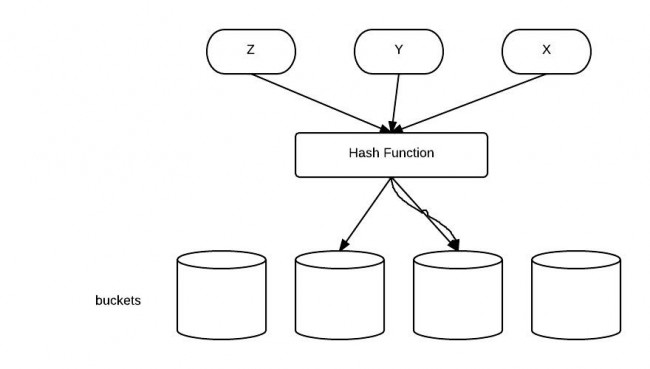
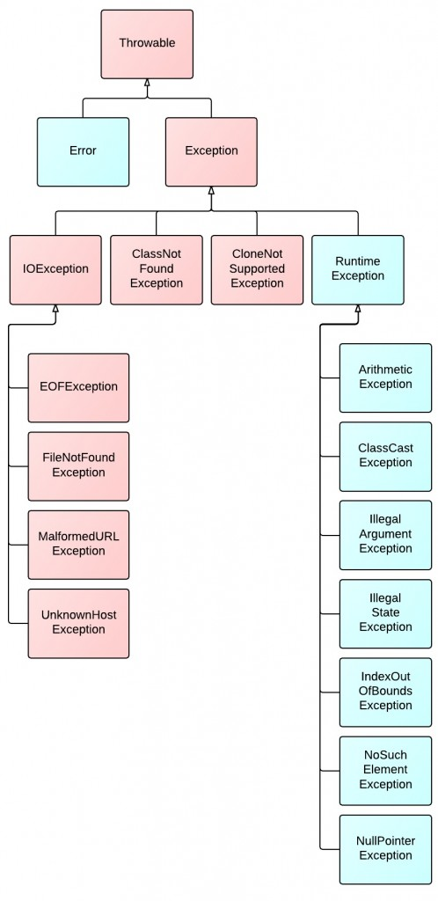
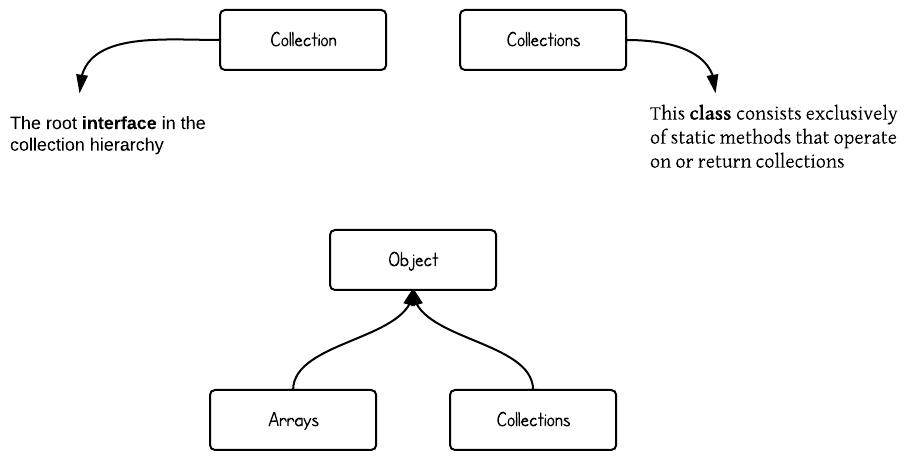
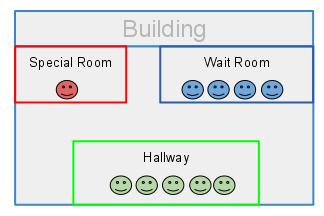
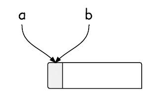
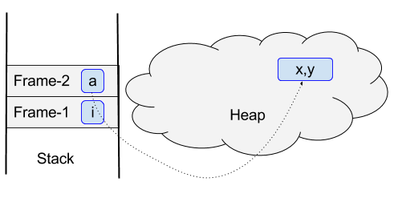

8张图理解Java[.](http://www.jcodecraeer.com/a/chengxusheji/java/2015/0616/3053.html)
----------------
> 一图胜千言，下面图解均来自Program Creek 网站的 [Java教程](http://www.programcreek.com/java-tutorials/)，目前它们拥有最多的票选。如果图解没有阐明问题，那么你可以借助它的标题来一窥究竟。

### 1、字符串不变性 ###
下面这张图展示了这段代码做了什么

```java
String s = "abcd";
s = s.concat("ef");
```


### 2、equals()方法、hashCode()方法的区别 ###
HashCode被设计用来提高性能。equals()方法与hashCode()方法的区别在于：

* 如果两个对象相等(equal)，那么他们一定有相同的哈希值。
* 如果两个对象的哈希值相同，但他们未必相等(equal)。



### 3、Java异常类的层次结构 ###
图中红色部分为受检查异常。它们必须被捕获，或者在函数中声明为抛出该异常。



### 4、集合类的层次结构 ###
注意Collections和Collection的区别。（Collections包含有各种有关集合操作的静态多态方法）



### 5、Java同步 ###
Java同步机制可通过类比建筑物来阐明。



### 6、别名 ###
别名意味着有多个变量指向同一可被更新的内存块，这些别名分别是不同的对象类型。



### 7、堆和栈 ###
图解表明了方法和对象在运行时内存中的位置。



### 8、Java虚拟机运行时数据区域 ###
图解展示了整个虚拟机运行时数据区域的情况。


原文链接： [programcreek](http://www.programcreek.com/2013/09/top-8-diagrams-for-understanding-java/)  </br>
译文链接： [http://www.importnew.com/11725.html]()