JVM的相关知识整理和学习[.](http://www.jcodecraeer.com/a/chengxusheji/java/2015/0730/3242.html)
----------------
> JVM是虚拟机，也是一种规范，他遵循着冯·诺依曼体系结构的设计原理。冯·诺依曼体系结构中，指出计算机处理的数据和指令都是二进制数，采用存储程序方式不加区分的存储在同一个存储器里，并且顺序执行，指令由操作码和地址码组成，操作码决定了操作类型和所操作的数的数字类型，地址码则指出地址码和操作数。从dos到window8，从unix到ubuntu和CentOS，还有MAC OS等等，不同的操作系统指令集以及数据结构都有着差异，而JVM通过在操作系统上建立虚拟机，自己定义出来的一套统一的数据结构和操作指令，把同一套语言翻译给各大主流的操作系统，实现了跨平台运行，可以说JVM是java的核心，是java可以一次编译到处运行的本质所在。

我研究学习了JVM的组成和运行原理，JVM的统一数据格式规范、字节码文件结构，JVM关于内存的管理。

##  一、JVM的组成和运行原理 ##
JVM的毕竟是个虚拟机，是一种规范，虽说符合冯诺依曼的计算机设计理念，但是他并不是实体计算机，所以他的组成也不是什么存储器，控制器，运算器，输入输出设备。在我看来，JVM放在运行在真实的操作系统中表现的更像应用或者说是进程，他的组成可以理解为JVM这个进程有哪些功能模块，而这些功能模块的运作可以看做是JVM的运行原理。JVM有多种实现，例如Oracle的JVM，HP的JVM和IBM的JVM等，而在本文中研究学习的则是使用最广泛的Oracle的HotSpot JVM。

###  1.JVM在JDK中的位置。  ###
JDK是java开发的必备工具箱，JDK其中有一部分是JRE，JRE是JAVA运行环境，JVM则是JRE最核心的部分。我从oracle.com截取了一张关于JDK Standard Edtion的组成图

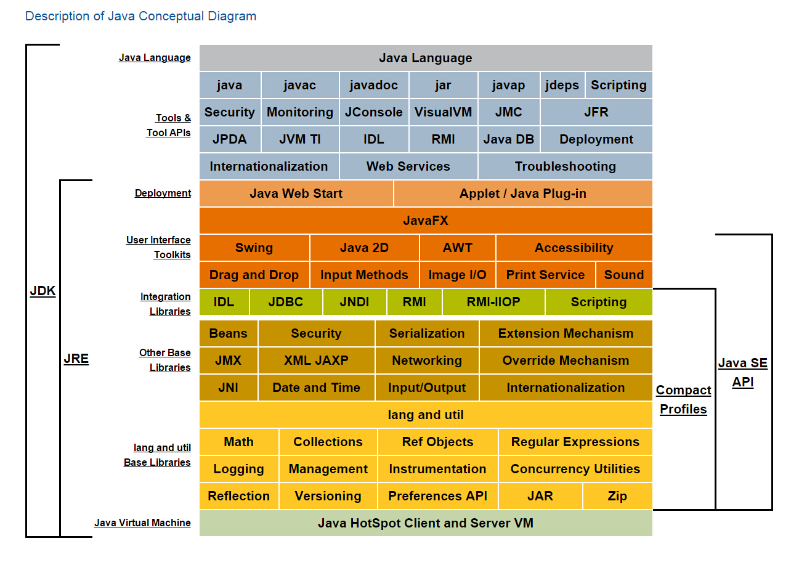

从最底层的位置可以看出来JVM有多重要，而实际项目中JAVA应用的性能优化，OOM等异常的处理最终都得从JVM这儿来解决。HotSpot是Oracle关于JVM的商标，区别于IBM，HP等厂商开发的JVM。Java HotSpot Client VM和Java HotSpot Server VM是JDK关于JVM的两种不同的实现，前者可以减少启动时间和内存占用，而后者则提供更加优秀的程序运行速度（参考自：[http://docs.oracle.com/javase/8/docs/technotes/guides/vm/index.html](http://docs.oracle.com/javase/8/docs/technotes/guides/vm/index.html) ，该文档有关于各个版本的JVM的介绍）。在命令行，通过java -version可以查看关于当前机器JVM的信息，下面是我在Win8系统上执行命令的截图

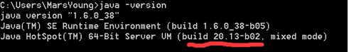

可以看出我装的是build 20.13-b02版本，HotSpot 类型Server模式的JVM。

### 2.JVM的组成 ###
JVM由4大部分组成：**ClassLoader，Runtime Data Area，Execution Engine，Native Interface**。  
我从CSDN找了一张描述JVM大致结构的图：

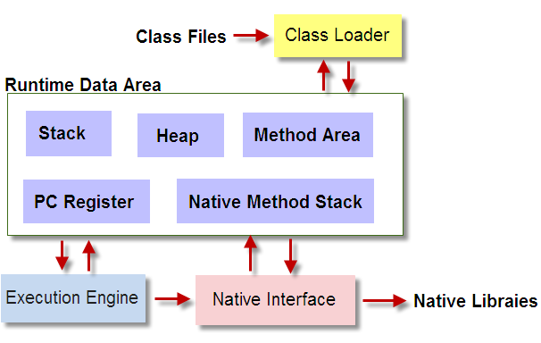

1. **ClassLoader** 是负责加载class文件，class文件在文件开头有特定的文件标示，并且ClassLoader只负责class文件的加载，至于它是否可以运行，则由Execution Engine决定。
2. **Native Interface** 是负责调用本地接口的。他的作用是调用不同语言的接口给JAVA用，他会在Native Method Stack中记录对应的本地方法，然后调用该方法时就通过Execution Engine加载对应的本地lib。原本多于用一些专业领域，如JAVA驱动，地图制作引擎等，现在关于这种本地方法接口的调用已经被类似于Socket通信，WebService等方式取代。
3. **Execution Engine** 是执行引擎，也叫Interpreter。Class文件被加载后，会把指令和数据信息放入内存中，Execution Engine则负责把这些命令解释给操作系统。
4. **Runtime Data Area** 则是存放数据的，分为五部分：**Stack，Heap，Method Area，PC Register，Native Method Stack**。几乎所有的关于java内存方面的问题，都是集中在这块。下图是javapapers.com上关于Run-time Data Areas的描述：

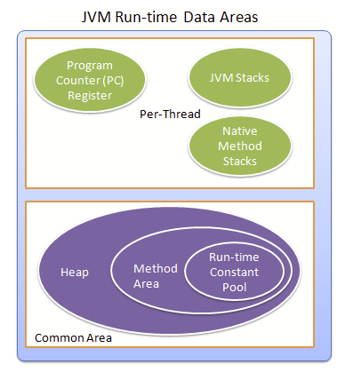

可以看出它把Method Area化为了Heap的一部分，javapapers.com中认为Method Area是Heap的逻辑区域，但这取决于JVM的实现者，而HotSpot JVM中把Method Area划分为非堆内存，显然是不包含在Heap中的。下图是javacodegeeks.com中，2014年9月刊出的一片博文中关于Runtime Data Area的划分，其中指出，NonHeap包含PermGen和Code Cache，PermGen包含Method Area,而且PermGen在JAVA SE 8中已经不再用了。查阅资料（[https://abhirockzz.wordpress.com/2014/03/18/java-se-8-is-knocking-are-you-there/](https://abhirockzz.wordpress.com/2014/03/18/java-se-8-is-knocking-are-you-there/)）得知，java8中PermGen已经从JVM中移除并被MetaSpace取代，java8中也不会见到OOM:PermGen Space的异常。目前Runtime Data Area可以用下图描述它的组成：

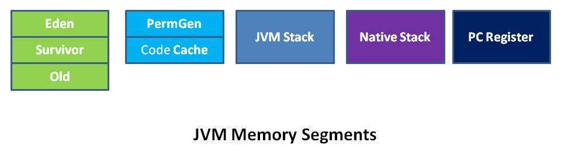

1. **Stack** 是java栈内存，它等价于C语言中的栈，栈的内存地址是不连续的，每个线程都拥有自己的栈。栈里面存储着的是StackFrame，在《JVM Specification》中文版中被译作java虚拟机框架，也叫做栈帧。StackFrame包含三类信息：局部变量，执行环境，操作数栈。局部变量用来存储一个类的方法中所用到的局部变量。执行环境用于保存解析器对于java字节码进行解释过程中需要的信息，包括：上次调用的方法、局部变量指针和操作数栈的栈顶和栈底指针。操作数栈用于存储运算所需要的操作数和结果。StackFrame在方法被调用时创建，在某个线程中，某个时间点上，只有一个框架是活跃的，该框架被称为Current Frame，而框架中的方法被称为Current Method，其中定义的类为Current Class。局部变量和操作数栈上的操作总是引用当前框架。当Stack Frame中方法被执行完之后，或者调用别的StackFrame中的方法时，则当前栈变为另外一个StackFrame。Stack的大小是由两种类型，固定和动态的，动态类型的栈可以按照线程的需要分配。 下面两张图是关于栈之间关系以及栈和非堆内存的关系基本描述（来自[http://www.programering.com/a/MzM3QzNwATA.html](http://www.programering.com/a/MzM3QzNwATA.html)）：   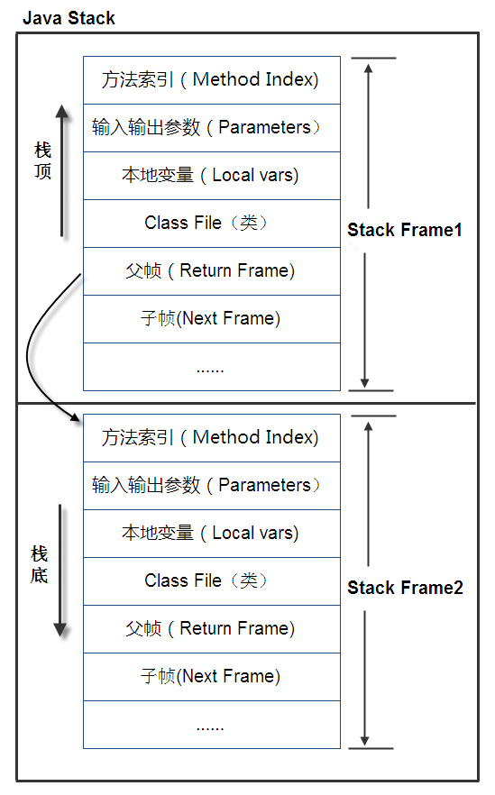  
2. **Heap** 是用来存放对象信息的，和Stack不同，Stack代表着一种运行时的状态。换句话说，栈是运行时单位，解决程序该如何执行的问题，而堆是存储的单位，解决数据存储的问题。Heap是伴随着JVM的启动而创建，负责存储所有对象实例和数组的。堆的存储空间和栈一样是不需要连续的，它分为Young Generation和Old Generation（也叫Tenured Generation）两大部分。Young Generation分为Eden和Survivor，Survivor又分为From Space和 ToSpace。 和Heap经常一起提及的概念是PermanentSpace，它是用来加载类对象的专门的内存区，是非堆内存，和Heap一起组成JAVA内存，它包含MethodArea区（在没有CodeCache的HotSpotJVM实现里，则MethodArea就相当于GenerationSpace）。在JVM初始化的时候，我们可以通过参数来分别指定，PermanentSpace的大小、堆的大小、以及Young Generation和Old Generation的比值、Eden区和From Space的比值，从而来细粒度的适应不同JAVA应用的内存需求。
3. **PC Register** 是程序计数寄存器，每个JAVA线程都有一个单独的PC Register，他是一个指针，由Execution Engine读取下一条指令。如果该线程正在执行java方法，则PC Register存储的是 正在被执行的指令的地址，如果是本地方法，PC Register的值没有定义。PC寄存器非常小，只占用一个字宽，可以持有一个returnAdress或者特定平台的一个指针。
4. **Method Area** 在HotSpot JVM的实现中属于非堆区，非堆区包括两部分：Permanet Generation和Code Cache，而Method Area属于Permanert Generation的一部分。Permanent Generation用来存储类信息，比如说：class definitions，structures，methods， field， method (data and code) 和 constants。Code Cache用来存储Compiled Code，即编译好的本地代码，在HotSpot JVM中通过JIT(Just In Time) Compiler生成，JIT是即时编译器，他是为了提高指令的执行效率，把字节码文件编译成本地机器代码，如下图：     引用一个经典的案例来理解Stack，Heap和Method Area的划分，就是Sring a="xx"；Stirng b="xx"，问是否a==b? 首先==符号是用来判断两个对象的引用地址是否相同，而在上面的题目中，a和b按理来说申请的是Stack中不同的地址，但是他们指向Method Area中Runtime Constant Pool的同一个地址，按照网上的解释，在a赋值为“xx”时，会在Runtime Contant Pool中生成一个String Constant，当b也赋值为“xx”时，那么会在常量池中查看是否存在值为“xx”的常量，存在的话，则把b的指针也指向“xx”的地址，而不是新生成一个String Constant。我查阅了网络上大家关于String Constant的存储的说说法，存在略微差别的是，它存储在哪里，有人说Heap中会分配出一个常量池，用来存储常量，所有线程共享它。而有人说常量池是Method Area的一部分，而Method Area属于非堆内存，那怎么能说常量池存在于堆中？   我认为，其实两种理解都没错。Method Area的确从逻辑上讲可以是Heap的一部分，在某些JVM实现里从堆上开辟一块存储空间来记录常量是符合JVM常量池设计目的的，所以前一种说法没问题。对于后一种说法，HotSpot JVM的实现中的确是把方法区划分为了非堆内存，意思就是它不在堆上。我在HotSpot JVM做了个简单的实验，定义多个常量之后，程序抛出OOM：PermGen Space异常，印证了JVM实现中常量池是在Permanent Space中的说法。但是，我的JDK版本是1.6的。查阅资料，JDK1.7中InternedStrings已经不再存储在PermanentSpace中，而是放到了Heap中；JDK8中PermanentSpace已经被完全移除，InternedStrings也被放到了MetaSpace中（如果出现内存溢出，会报OOM:MetaSpace，这里有个关于两者性能对比的文章：[http://blog.csdn.net/zhyhang/article/details/17246223](http://blog.csdn.net/zhyhang/article/details/17246223) ）。 所以，仁者见仁，智者见智，一个馒头足以引发血案，就算是同一个商家的JVM，毕竟JDK版本在更新，或许正如StackOverFlow上大神们所说，对于理解JVM Runtime Data Area这一部分的划分逻辑，还是去看对应版本的JDK源码比较靠谱，或者是参考不同的版本JVM Specification（ [http://docs.oracle.com/javase/specs/](http://docs.oracle.com/javase/specs/) ）。
5. **Native Method Stack** 是供本地方法（非java）使用的栈。每个线程持有一个Native Method Stack。

### 3.JVM的运行原理简介 ###
Java 程序被javac工具编译为.class字节码文件之后，我们执行java命令，该class文件便被JVM的Class Loader加载，可以看出JVM的启动是通过JAVA Path下的java.exe或者java进行的。JVM的初始化、运行到结束大概包括这么几步：

调用操作系统API判断系统的CPU架构，根据对应CPU类型寻找位于JRE目录下的/lib/jvm.cfg文件，然后通过该配置文件找到对应的jvm.dll文件（如果我们参数中有-server或者-client， 则加载对应参数所指定的jvm.dll，启动指定类型的JVM），初始化jvm.dll并且挂接到JNIENV结构的实例上，之后就可以通过JNIENV实例装载并且处理class文件了。class文件是字节码文件，它按照JVM的规范，定义了变量，方法等的详细信息，JVM管理并且分配对应的内存来执行程序，同时管理垃圾回收。直到程序结束，一种情况是JVM的所有非守护线程停止，一种情况是程序调用System.exit()，JVM的生命周期也结束。
    
关于JVM如何管理分配内存，我通过class文件和垃圾回收两部分进行了学习。

## 二、JVM的内存管理和垃圾回收 ##
JVM中的内存管理主要是指JVM对于Heap的管理，这是因为Stack，PC Register和Native Method Stack都是和线程一样的生命周期，在线程结束时自然可以被再次使用。虽然说，Stack的管理不是重点，但是也不是完全不讲究的。

### 1.栈的管理 ###
JVM允许栈的大小是固定的或者是动态变化的。在Oracle的关于参数设置的官方文档中有关于[Stack的设置](http://docs.oracle.com/cd/E13150_01/jrockit_jvm/jrockit/jrdocs/refman/optionX.html#wp1024112)，是通过-Xss来设置其大小。关于Stack的默认大小对于不同机器有不同的大小，并且不同厂商或者版本号的jvm的实现其大小也不同，如下表是HotSpot的默认大小：

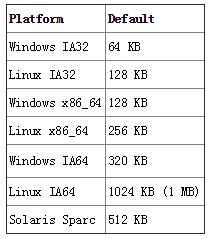

我们一般通过减少常量，参数的个数来减少栈的增长，在程序设计时，我们把一些常量定义到一个对象中，然后来引用他们可以体现这一点。另外，少用递归调用也可以减少栈的占用。

栈是不需要垃圾回收的，尽管说垃圾回收是java内存管理的一个很热的话题，栈中的对象如果用垃圾回收的观点来看，他永远是live状态，是可以reachable的，所以也不需要回收，他占有的空间随着Thread的结束而释放。（参考自：[http://stackoverflow.com/questions/20030120/java-default-stack-size](http://stackoverflow.com/questions/20030120/java-default-stack-size)）

关于栈一般会发生以下两种异常：

1. 当线程中的计算所需要的栈超过所允许大小时，会抛出StackOverflowError。
2. 当Java栈试图扩展时，没有足够的存储器来实现扩展，JVM会报OutOfMemoryError。

我针对栈进行了实验，由于递归的调用可以致使栈的引用增加，导致溢出，所以设计代码如下：

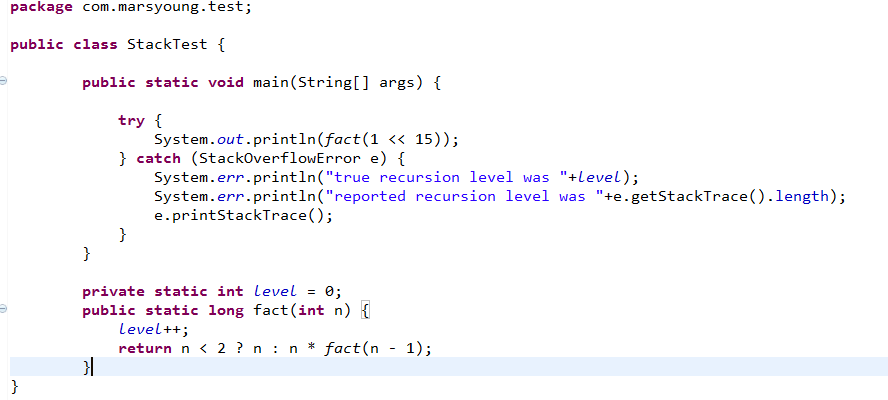

我的机器是x86_64系统，所以Stack的默认大小是128KB，上述程序在运行时会报错：

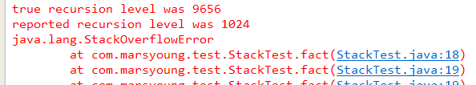

而当我在eclipse中调整了-Xss参数到3M之后，该异常消失。

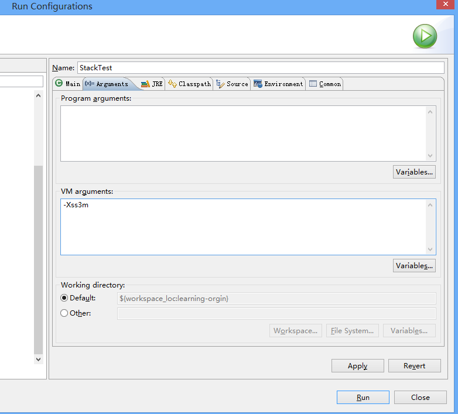

另外栈上有一点得注意的是，对于本地代码调用，可能会在栈中申请内存，比如C调用malloc()，而这种情况下，GC是管不着的，需要我们在程序中，手动管理栈内存，使用free()方法释放内存。

### 2.堆的管理 ###
堆的管理要比栈管理复杂的多，我通过堆的各部分的作用、设置，以及各部分可能发生的异常，以及如何避免各部分异常进行了学习。

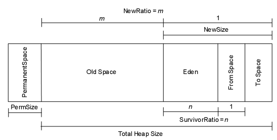

上图是 Heap和PermanentSapce的组合图，其中 Eden区里面存着是新生的对象，From Space和To Space中存放着是每次垃圾回收后存活下来的对象 ，所以每次垃圾回收后，Eden区会被清空。 存活下来的对象先是放到From Space，当From Space满了之后移动到To Space。当To Space满了之后移动到Old Space。Survivor的两个区是对称的，没先后关系，所以同一个区中可能同时存在从Eden复制过来 对象，和从前一个Survivor复制过来的对象，而复制到年老区的只有从第一个Survivor复制过来的对象。而且，Survivor区总有一个是空的。同时，根据程序需要，Survivor区是可以配置为多个的（多于两个），这样可以增加对象在年轻代中的存在时间，减少被放到年老代的可能。

Old Space中则存放生命周期比较长的对象，而且有些比较大的新生对象也放在Old Space中。

堆的大小通过-Xms和-Xmx来指定最小值和最大值，通过-Xmn来指定Young Generation的大小（一些老版本也用-XX:NewSize指定）， 即上图中的Eden加FromSpace和ToSpace的总大小。然后通过-XX:NewRatio来指定Eden区的大小，在Xms和Xmx相等的情况下，该参数不需要设置。通过-XX：SurvivorRatio来设置Eden和一个Survivor区的比值。（参考自博文：[http://www.cnblogs.com/redcreen/archive/2011/05/04/2037057.html](http://www.cnblogs.com/redcreen/archive/2011/05/04/2037057.html)）

堆异常分为两种，一种是Out of Memory(OOM)，一种是Memory Leak(ML)。Memory Leak最终将导致OOM。实际应用中表现为：从Console看，内存监控曲线一直在顶部，程序响应慢，从线程看，大部分的线程在进行GC，占用比较多的CPU，最终程序异常终止，报OOM。OOM发生的时间不定，有短的一个小时，有长的10天一个月的。关于异常的处理，确定OOM/ML异常后，一定要注意保护现场，可以dump heap，如果没有现场则开启GCFlag收集垃圾回收日志，然后进行分析，确定问题所在。如果问题不是ML的话，一般通过增加Heap，增加物理内存来解决问题，是的话，就修改程序逻辑。

### 3.垃圾回收 ###
JVM中会在以下情况触发回收：对象没有被引用，作用域发生未捕捉异常，程序正常执行完毕，程序执行了System.exit()，程序发生意外终止。

JVM中标记垃圾使用的算法是一种**根搜索算法**。简单的说，就是从一个叫GC Roots的对象开始，向下搜索，如果一个对象不能达到GC Roots对象的时候，说明它可以被回收了。这种算法比一种叫做**引用计数法的垃圾标记算法**要好，因为它避免了当两个对象啊互相引用时无法被回收的现象。
    
JVM中对于被标记为垃圾的对象进行回收时又分为了一下3种算法：

1. **标记清除算法**，该算法是从根集合扫描整个空间，标记存活的对象，然后在扫描整个空间对没有被标记的对象进行回收，这种算法在存活对象较多时比较高效，但会产生内存碎片。
2. **复制算法**，该算法是从根集合扫描，并将存活的对象复制到新的空间，这种算法在存活对象少时比较高效。
3. **标记整理算法**，标记整理算法和标记清除算法一样都会扫描并标记存活对象，在回收未标记对象的同时会整理被标记的对象，解决了内存碎片的问题。

JVM中，不同的 内存区域作用和性质不一样，使用的垃圾回收算法也不一样，所以JVM中又定义了几种不同的垃圾回收器（图中连线代表两个回收器可以同时使用）：

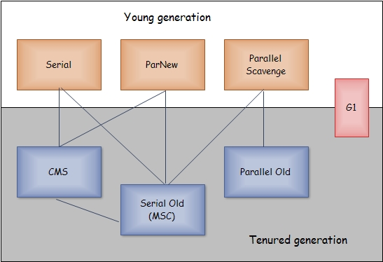

1. **Serial GC**。从名字上看，串行GC意味着是一种单线程的，所以它要求收集的时候所有的线程暂停。这对于高性能的应用是不合理的，所以串行GC一般用于Client模式的JVM中。
2. **ParNew GC**。是在SerialGC的基础上，增加了多线程机制。但是如果机器是单CPU的，这种收集器是比SerialGC效率低的。
3. **Parrallel Scavenge GC**。这种收集器又叫吞吐量优先收集器，而吞吐量=程序运行时间/(JVM执行回收的时间+程序运行时间),假设程序运行了100分钟，JVM的垃圾回收占用1分钟，那么吞吐量就是99%。Parallel Scavenge GC由于可以提供比较不错的吞吐量，所以被作为了server模式JVM的默认配置。
4. **ParallelOld**是老生代并行收集器的一种，使用了标记整理算法，是JDK1.6中引进的，在之前老生代只能使用串行回收收集器。
5. **Serial Old**是老生代client模式下的默认收集器，单线程执行，同时也作为CMS收集器失败后的备用收集器。
6. **CMS** 又称响应时间优先回收器，使用标记清除算法。他的回收线程数为(CPU核心数+3)/4，所以当CPU核心数为2时比较高效些。CMS分为4个过程：初始标记、并发标记、重新标记、并发清除。
7. **GarbageFirst（G1）**。比较特殊的是G1回收器既可以回收Young Generation，也可以回收Tenured Generation。它是在JDK6的某个版本中才引入的，性能比较高，同时注意了吞吐量和响应时间。

对于垃圾收集器的组合使用可以通过下表中的参数指定：

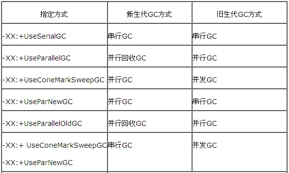

默认的GC种类可以通过jvm.cfg或者通过jmap dump出heap来查看，一般我们通过jstat -gcutil [pid] 1000可以查看每秒gc的大体情况，或者可以在启动参数中加入：-verbose:gc -XX:+PrintGCTimeStamps -XX:+PrintGCDetails -Xloggc:./gc.log来记录GC日志。

GC中有一种情况叫做Full GC，以下几种情况会触发Full GC：

1. Tenured Space空间不足以创建打的对象或者数组，会执行FullGC，并且当FullGC之后空间如果还不够，那么会OOM:java heap space。
2. Permanet Generation的大小不足，存放了太多的类信息，在非CMS情况下回触发FullGC。如果之后空间还不够，会OOM:PermGen space。
3. CMS GC时出现promotion failed和concurrent mode failure时，也会触发FullGC。promotion failed是在进行Minor GC时，survivor space放不下、对象只能放入旧生代，而此时旧生代也放不下造成的；concurrent mode failure是在执行CMS GC的过程中同时有对象要放入旧生代，而此时旧生代空间不足造成的。
4. 判断MinorGC后，要晋升到TenuredSpace的对象大小大于TenuredSpace的大小，也会触发FullGC。

 可以看出，当FullGC频繁发生时，一定是内存出问题了。

## 三、JVM的数据格式规范和Class文件 ##
### 1.数据类型规范 ###
依据冯诺依曼的计算机理论，计算机最后处理的都是二进制的数，而JVM是怎么把java文件最后转化成了各个平台都可以识别的二进制呢？JVM自己定义了一个抽象的存储数据单位，叫做**Word**。一个字足够大以持有byte、char、short、int、float、reference或者returnAdress的一个值，两个字则足够持有更大的类型long、double。它通常是主机平台一个指针的大小，如32位的平台上，字是32位。

同时JVM中定义了它所支持的基本数据类型，包括两部分：数值类型和returnAddress类型。数值类型分为整形和浮点型。

**整形：**

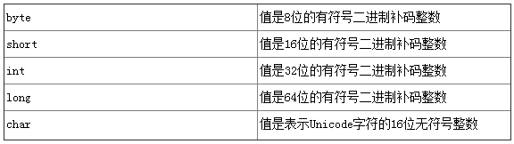

**浮点：**

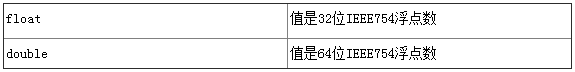

returnAddress类型的值是Java虚拟机指令的操作码的指针。

对比java的基本数据类型，jvm的规范中没有boolean类型。这是因为jvm中堆boolean的操作是通过int类型来进行处理的，而boolean数组则是通过byte数组来进行处理。
    
至于String，我们知道它存储在常量池中，但他不是基本数据类型，之所以可以存在常量池中，是因为这是JVM的一种规定。如果查看String源码，我们就会发现，**String其实就是一个基于基本数据类型char的数组**。如图：

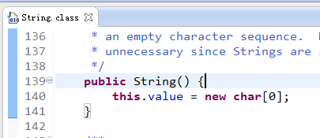

### 2.字节码文件 ###
通过字节码文件的格式我们可以看出jvm是如何规范数据类型的。下面是ClassFile的结构：

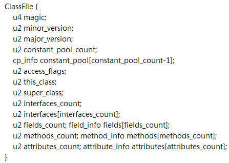

关于各个字段的定义（参考自JVM Specification 和 博文：[http://www.cnblogs.com/zhuYears/archive/2012/02/07/2340347.html](http://www.cnblogs.com/zhuYears/archive/2012/02/07/2340347.html)）

**magic：**魔数，魔数的唯一作用是确定这个文件是否为一个能被虚拟机所接受的Class文件。魔数值固定为0xCAFEBABE，不会改变。

**minor_version、major_version：**分别为Class文件的副版本和主版本。它们共同构成了Class文件的格式版本号。不同版本的虚拟机实现支持的Class文件版本号也相应不同，高版本号的虚拟机可以支持低版本的Class文件，反之则不成立。

**constant_pool_count：**常量池计数器，constant_pool_count的值等于constant_pool表中的成员数加1。

**constant_pool[]：**常量池，constant_pool是一种表结构，它包含Class文件结构及其子结构中引用的所有字符串常量、类或接口名、字段名和其它常量。常量池不同于其他，索引从1开始到constant_pool_count -1。

**access_flags：**访问标志，access_flags是一种掩码标志，用于表示某个类或者接口的访问权限及基础属性。access_flags的取值范围和相应含义见下表：

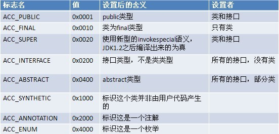

**this_class：**类索引，this_class的值必须是对constant_pool表中项目的一个有效索引值。constant_pool表在这个索引处的项必须为CONSTANT_Class_info类型常量，表示这个Class文件所定义的类或接口。

**super_class：**父类索引，对于类来说，super_class的值必须为0或者是对constant_pool表中项目的一个有效索引值。如果它的值不为0，那constant_pool表在这个索引处的项必须为CONSTANT_Class_info类型常量，表示这个Class文件所定义的类的直接父类。当然，如果某个类super_class的值是0，那么它必定是java.lang.Object类，因为只有它是没有父类的。

**interfaces_count：**接口计数器，interfaces_count的值表示当前类或接口的直接父接口数量。

**interfaces[]：**接口表，interfaces[]数组中的每个成员的值必须是一个对constant_pool表中项目的一个有效索引值，它的长度为interfaces_count。每个成员interfaces[i] 必须为CONSTANT_Class_info类型常量。

**fields_count：**字段计数器，fields_count的值表示当前Class文件fields[]数组的成员个数。

**fields[]：**字段表，fields[]数组中的每个成员都必须是一个fields_info结构的数据项，用于表示当前类或接口中某个字段的完整描述。

**methods_count：**方法计数器，methods_count的值表示当前Class文件methods[]数组的成员个数。

**methods[]：**方法表，methods[]数组中的每个成员都必须是一个method_info结构的数据项，用于表示当前类或接口中某个方法的完整描述。

**attributes_count：**属性计数器，attributes_count的值表示当前Class文件attributes表的成员个数。

**attributes[]：**属性表，attributes表的每个项的值必须是attribute_info结构。

## 四、一个java类的实例分析 ##
为了了解JVM的数据类型规范和内存分配的大体情况，我新建了MemeryTest.java：

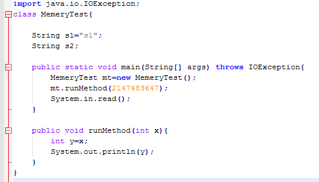

编译为MemeryTest.class后，通过WinHex查看该文件，对应字节码文件各个部分不同的定义，我了解了下面16进制数值的具体含义，尽管不清楚ClassLoader的具体实现逻辑，但是可以想象这样一个严谨格式的文件给JVM对于内存管理和执行程序提供了多大的帮助。

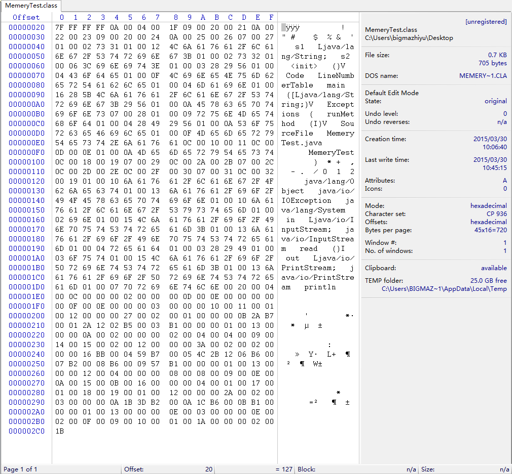

运行程序后，我在windows资源管理器中找到对应的进程ID.

并且在控制台通过jmap -heap 10016查看堆内存的使用情况：

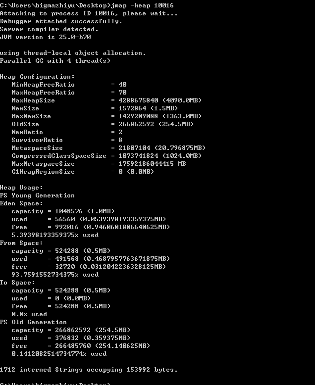

输出结果中表示当前java进程启动的JVM是通过4个线程进行Parallel GC，堆的最小FreeRatio是40%，堆的最大FreeRatio是70%，堆的大小是4090M，新对象占用1.5M，Young Generation可以扩展到最大是1363M， Tenured Generation的大小是254.5M，以及NewRadio和SurvivorRadio中，下面更是具体给出了目前Young Generation中1.5M的划分情况，Eden占用1.0M，使用了5.4%，Space占了0.5M,使用了93%，To Space占了0.5M,使用了0%。

下面我们通过jmap dump把heap的内容打印打文件中：

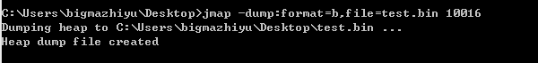

使用Eclipse的MAT插件打开对应的文件：

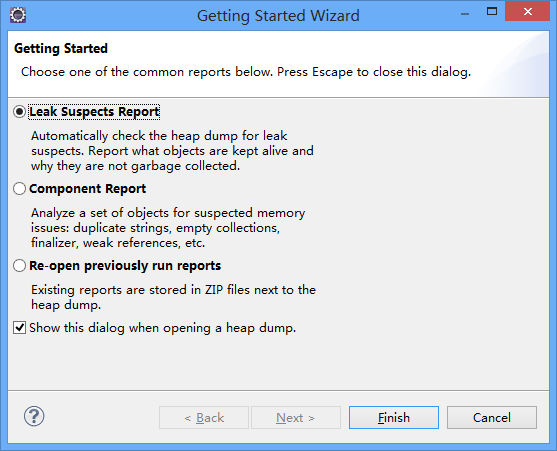

选择第一项内存泄露分析报告打开test.bin文件，展示出来的是MAT关于内存可能泄露的分析。

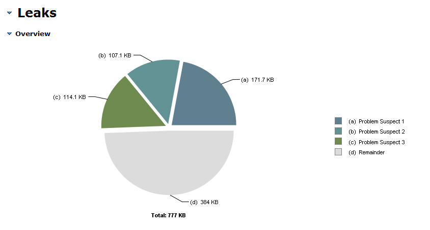

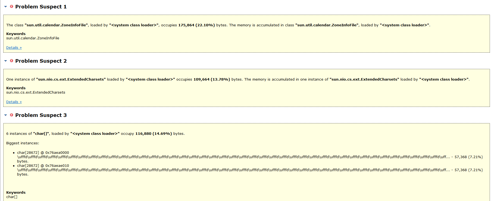

从结果来看，有3个地方可能存在内存泄露，他们占据了Heap的22.10%，13.78%，14.69%，如果内存泄露，这里一般会有一个比值非常高的对象。打开第一个Probem Suspect，结果如下：

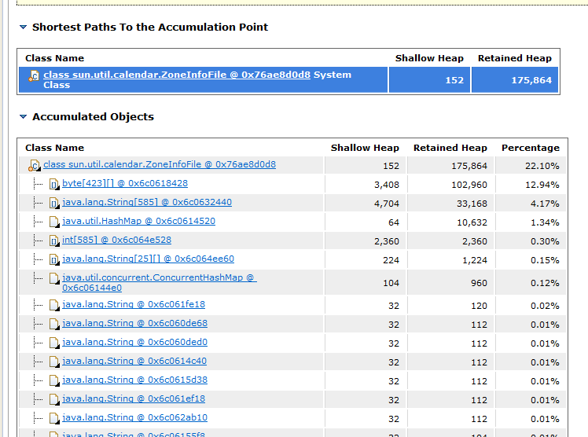

ShallowHeap是对象本身占用的堆大小，不包含引用，RetainedHeap是对象所持有的Shallowheap的大小，包括自己ShallowHeap和可以引用的对象的ShallowHeap。垃圾回收的时候，如果一个对象不再引用后被回收，那么他的RetainedHeap是能回收的内存总和。通过上图可以看出程序中并没有什么内存泄露，可以放心了。如果还有什么不太确定的对象，则可以通过多个时间点的HeapDumpFile来研究某个对象的变化情况。

## 五、小结  ##
以上便是我最近几天对JVM相关资料的整理，主要围绕他的基本组成和运行原理等，内存管理，节本数据类型和字节码文件。JVM是一个非常优秀的JAVA程序，也是个不错的规范，这次整理学习让我对他有了更加清晰的认知，对Java语言的理解也更加加深。 
   
这次学习过程，坚定了我对程序员发展的认知。知识一定要精，下一步我将边工作边仔细阅读Oracle的3个版本的《JVM Specification》，并且结合实践让自己的Java基础素养更上一个层次。([http://docs.oracle.com/javase/specs/](http://docs.oracle.com/javase/specs/))

原文出处： [CSDN - bigmazhiyu](http://blog.csdn.net/mshootingstar/article/details/44783227)